# 개발 현황
---
## Nest와 MySQL EC2 배포 완료
 

1) EOF 들여쓰기 문제 - **echo 명령어로 해결**
2) pm2 백그라운드 문제 - **pm2 runtime으로 해결**
3) TypeORM 매핑 에러 - **mySQL 8.0 이상 version 이슈**

 

배포 과정에서 겪었던 큰 이슈 3 가지였다. 이것들을 해결하고 난 뒤, 다음과 같은 과정을 통해 자동으로 배포가 진행되도록 구현했다.

이미지 생성 및 Docker Hub로 푸시하면,GitHub Actions가 트리거되어 코드가 체크아웃되고, Node.js와 필요한 패키지들이 설치된다음, 프로젝트가 빌드된다. 

그 후 Docker 이미지를 생성하고, 생성된 이미지를 Docker Hub에 푸시한다.

Actions secrets에 있는 EC2키와 AWS 시크릿과 액세스키를 활용해 내 EC2 인스턴스에 접속한 후, Docker Hub에 푸시된 이미지를 EC2 인스턴스에서 가져온다.

필요한 환경 변수를 설정한 후, Docker Compose를 사용해 컨테이너를 실행하고, 이전에 사용된 도커 이미지를 정리하여 공간을 확보한다.

이렇게 구현하고 나니, 현재까지는 특별한 문제가 없다. 추후 프론트엔드 구축이 끝나면, 도메인을 사서 SSL 인증까지 마저 끝내보도록 해야겠다.

CloudFront와 S3 설정과정에서 AWS WAF를 사용하도록 했었는데, 프리티어에서도 과금이 되는지 몰랐다. 

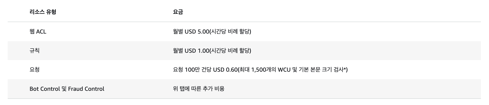

이게 WAF 요금표이다. 이걸 모르고 쓰는 바람에 1,000원이 날라갔다....

물론 이야기를 들어보면, WAF가 정말 유용한 것 맞지만 개발 단계에서 필요하진 않다고 생각한다.

다른 분들은 나처럼 실수하지말고, 돈이 들만하다 싶으면 꼭 철저하게 검색해보자..
 
 

## 명세서에 따른 ERD와 목업 작업 완료

---

### 1. 3D 햄버거 커스터마이징 툴

| 기능 | 세부 기능 | 요구사항 |
| --- | --- | --- |
| 3D 인터페이스 | 사용자가 실시간으로 햄버거의 각 구성 요소(번, 패티, 치즈, 채소 등)를 선택하고 조합할 수 있는 3D 인터페이스 제공 | 3D 모델링과 실시간 렌더링 지원 |
| 드래그 앤 드롭 | 각 재료를 드래그 앤 드롭으로 추가하거나 제거할 수 있는 기능 | 직관적인 UI/UX 디자인 |
| 우측 패널 | 현대차 UI와 유사한 우측 패널을 통한 재료 선택 기능 제공 | 재료별 텍스처 및 애니메이션 지원 |

---

### 2. 사용자 계정 관리

| 기능 | 세부 기능 | 요구사항 |
| --- | --- | --- |
| 사용자 관리 | 사용자 등록, 로그인 및 프로필 관리 기능 | 안전한 인증 및 인가 시스템 구현 |
| 소셜 로그인 | 소셜 미디어 계정을 통한 로그인 기능 제공 (예: Facebook, Google) | 사용자 데이터베이스 설계 및 관리, OAuth 2.0 또는 OpenID Connect 통합 |

---

### 3. 커뮤니티 기능

| 기능 | 세부 기능 | 요구사항 |
| --- | --- | --- |
| 갤러리 | 사용자가 커스터마이즈한 햄버거를 저장하고 공유할 수 있는 갤러리 | 갤러리 뷰 및 사용자 간 상호작용 지원 |
| 좋아요 및 댓글 | 다른 사용자의 햄버거 디자인에 '좋아요', '댓글' 달기 기능 | 댓글 및 리뷰 시스템 구현, 실시간 알림 기능 제공 |

---

### 4. 실시간 피드백 및 투표 시스템

| 기능 | 세부 기능 | 요구사항 |
| --- | --- | --- |
| 실시간 투표 | 사용자가 제작한 햄버거에 대해 실시간으로 투표하고 순위를 매기는 기능 | 실시간 투표 시스템 구현 |
| 인기 디자인 선정 | 가장 인기 있는 햄버거 디자인을 주간 또는 월간으로 선정 | 투표 결과에 따른 순위 및 통계 제공, 주간/월간 인기 디자인 선정 및 표시 기능 |

---

### 5. 커스터마이징 가이드 및 튜토리얼

| 기능 | 세부 기능 | 요구사항 |
| --- | --- | --- |
| 안내 및 튜토리얼 | 햄버거 커스터마이징 방법에 대한 안내와 튜토리얼 제공 | 튜토리얼 동영상 및 텍스트 콘텐츠 제작 |
| 단계별 가이드 | 초보자도 쉽게 따라 할 수 있는 단계별 가이드 | 단계별 가이드 UI/UX 설계, 도움말 및 FAQ 섹션 제공 |

---

이렇게 명세서도 만들고 임시로 ERD도 설계했다.

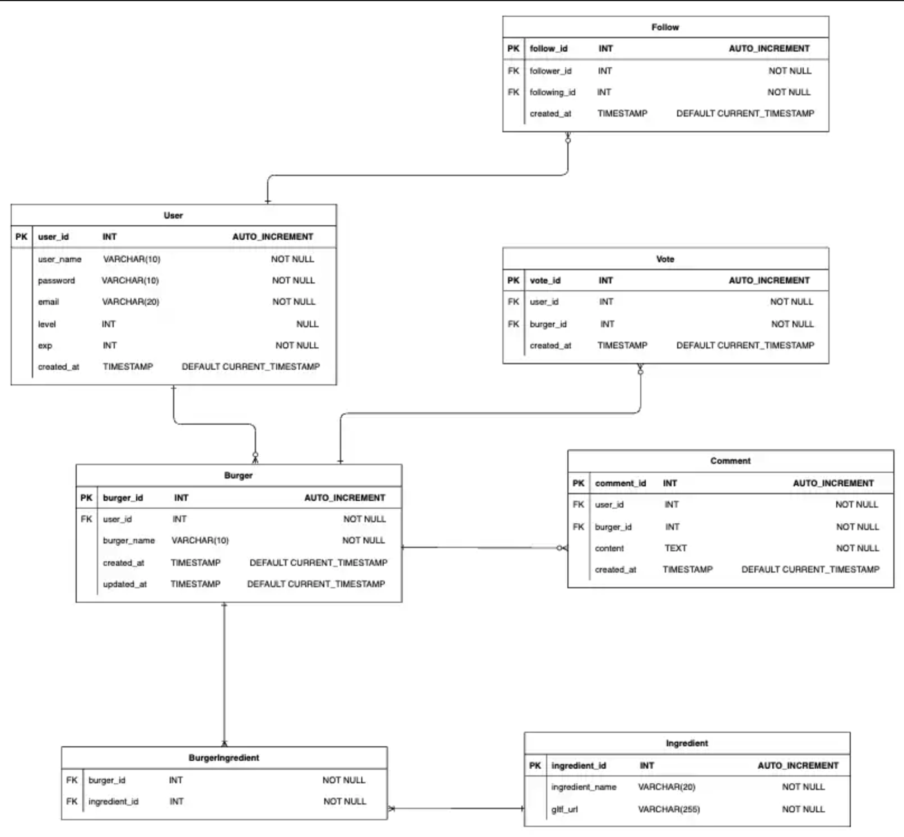

빠르게 목업도 만들어봤다.

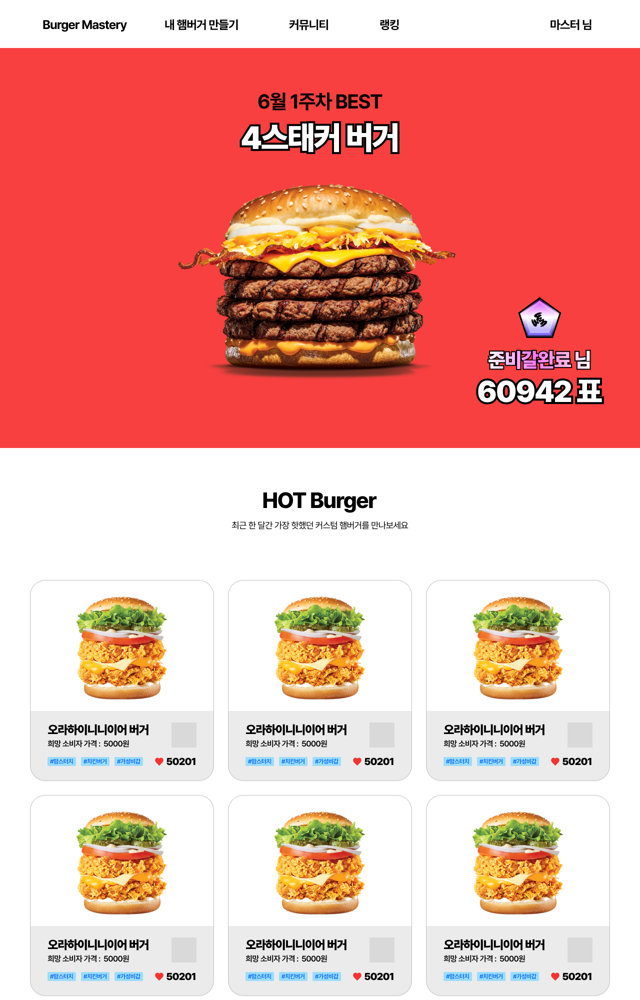
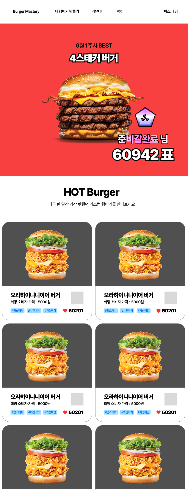
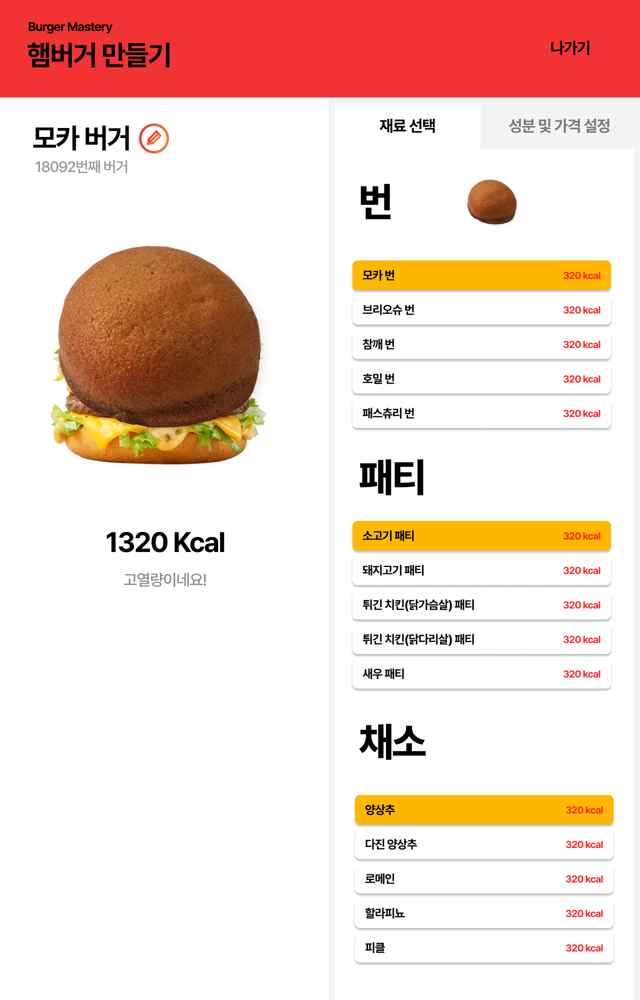
 
 

## 햄버거.. 이게 맞나?

그런데... 문제가 생겼다.
프로젝트 기획 단계에서 1인 개발의 고려요소를 시간 관리와 자원, 우선 순위, 초심 등을 꼽았었는데, 중요한 걸 빼먹었다.

그게 뭐냐면 바로 `의욕`이다.
목업을 짜다가 내 서비스가 흥미롭지 않다는 생각이 들었다.

햄버거를 커스터마이징 해서 나만의 햄버거를 만들었다 치자. 
그런데 과연 이게 사용자에게 매력적일까?

일단 버거의 경우의 수는 충분하다. 현실적으로 번 종류 7개, 패티 종류 10개, 야채 종류 10개 정도를 작업할 수 있을 것이다. 번은 무조건 쓴다고 치고, 패티와 재료는 꼭 안넣어도 된다고 가정하면, 총 경우의 수는 7,340,032가지 정도다.

하지만 최대 730만개 가량의 다양한 햄버거가 만들어지려면, 사용자가 서비스를 많이 이용해야하고, 그러기 위해선 사용자가 커스텀하는 행위 자체에 흥미를 느껴야할텐데, 햄버거는 모티브가 된 현대자동차와는 성격이 다르다.

사람들이 제네시스 내 차 만들기 기능을 좋아하는 이유는 자동차가 고관여 제품인데다가 누가봐도 멋진 퀄리티를 자랑하기 때문에 고급진 느낌을 구현했을때, 그 효과가 극대화되지 않을까?

그에 비해 내 햄버거는 저관여 제품인데다가 식품이다. 오히려 감성적으로 다가가야 하지 않나? 그래서 차라리 실사와 같은 모델이 아니라 판타지 요소를 가미해서, 궁극의 버거를 재미로 만들어보는 방향으로 틀어서 감성적 소구를 해볼까 했다.

gpt에게 이미지를 부탁하니,

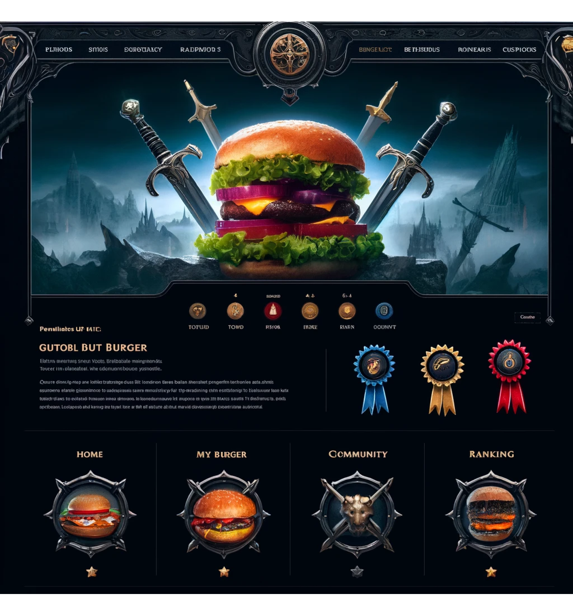

와우!! 이런 결과물을 던져줬다. 서비스 이름인 버거 마스터리라는 이름에도 어울리고 그냥 봤을 때 흥미로운 느낌이 팍팍 들었다. 

하지만, 이런 디자인과 컨셉을 유지하기엔 디자인 소요가 너무 커진다. 현실적으로 힘들다는 것이고, 기능 구현도 버거 전쟁, 버거 배틀, 길드 등.. 이런 게임적인 요소를 넣어야할 것만 같다.

커스텀, 조합, “이런 상품이 있었으면...” 이라는 그 니즈에 포커싱해서 차라리 버거에 한정짓지말고 커스텀 음식에 포커싱을 해볼까도 생각했다. 하지만 이것도 근본적인 문제를 해결해주진 못했고, 이런 생각이 줄을 이으니 더 이상 작업을 하고 싶지 않아졌다.

내 서비스를 만드는 것이니 기획도 중요하긴 하지만, 너무 배보다 배꼽이 커지는 기분이 들었고, 그냥 다 엎어버리고 새로 시작하고 싶었다.

결국 프로젝트 목표부터 다시 세우기로 했다.
  

## 프로젝트의 목표
- 실제 서비스를 운영하며 성능 개선 및 유지보수 경험을 해보자. 
  
- 프론트, 백, 인프라 경험을 통해 개발 프로세스를 이해하고, 추상적이지 않은 소통역량을 강화하자.
  
- 주어진 환경과 자원에 맞는 기술을 선택할 줄 알고, 왜 이 기술을 활용했는지 설명할 수 있도록 하자.

- 의욕을 잃지 말고 끝까지 개발하자.

기존 목표와 크게 달라진 것 없지만, 서비스 자체에 의문을 품어 의욕을 잃고 햄버거를 갈아 엎은 입장에서는 마지막 목표가 가장 눈에 들어온다. 

나머지 목표는 결국 끝까지 개발하면 자연스럽게 이뤄낼 수 있을테니, 지금은 의욕을 살릴 주제를 찾는 것에 집중하기로 한다.
  

## 그래서 선택한 새로운 주제은 뭘까?

결론부터 말하자면 `"힐링"`이다. 요즘 세상을 바라보면, 사람들이 정말 화가 많다. 

기분 좋은 소식을 나누기 보단, 누가 뭘 잘못했느니, 누가 어떤 짓을 했느니 하며 책임을 묻는다. 예전같으면 그냥 넘어갔을 일도 팩트체크를 운운하며 끝장을 보는 기조가 만연하다.

다들 여유가 없어서 그런거라 생각한다. 그럴법도 한 게 당장 나만해도 그렇고 또래들은 원하는 곳에 취업도 못하고, 결혼도 못하고, 돈도 없다. 내 윗세대든 아랫세대라고 사정이 다를까?마찬가지다. 그들 나름대로 고충이 있을 것이고, 그게 회복되지 않으니 점점 예민해지는 것 같다.

아무튼 이런 각박한 세상에, 그냥 따지는 거 없이 묵묵하게 위로를 던져주는 서비스가 있으면 좋겠다고 생각했다.

내가 만든 서비스로 세상에 편익을 주자! 라는 조금 오그라들지만 한편으론 낭만있다고 생각하는 내 가치관에도 제일 부합하는 주제다.

그래서 숲 속 작은 카페 `"CAFE KKYUNG"` 서비스를 기획하게 됐다.
 
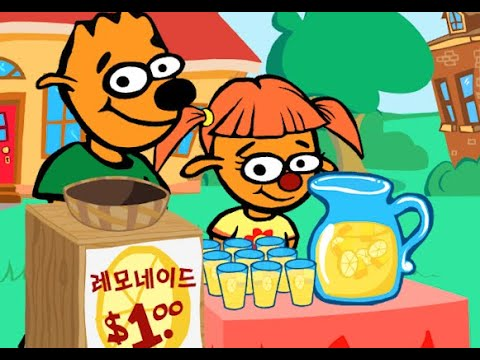

마치 알피의 레모네이드 만들기처럼, 내가 하는 일을 잘했다고 응원해주고, 어려운 과정없이 뭔갈 이뤄낸 기분을 주게하는 그런 서비스.

이정도로 구체화하고나니, 의욕이 팍팍 늘어났다. 바로 피그마 작업에 들어갔고, 대략적으로 화면 구성을 완료했다. 가치관에 가장 부합하는 프로젝트를 해서 그런가 지금도 의욕이 샘솟는다.
  
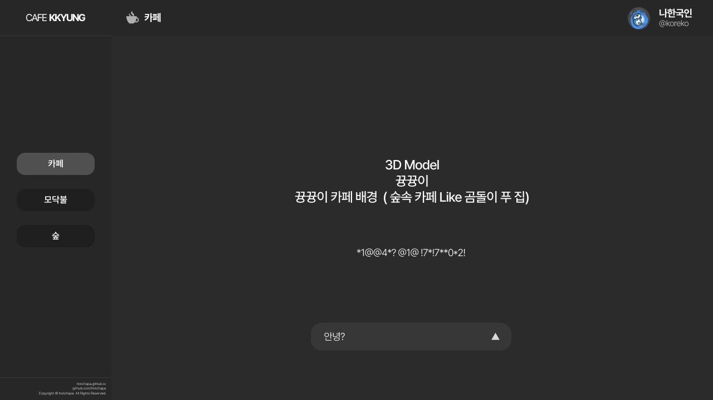

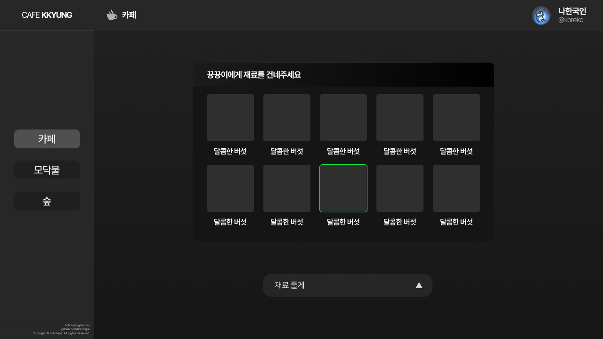

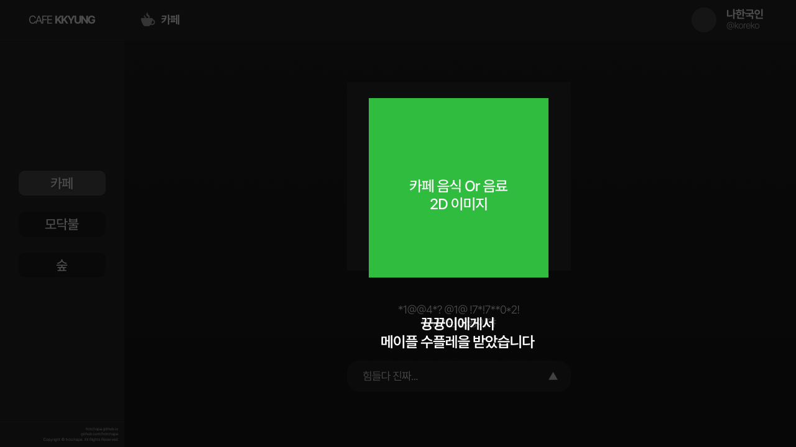

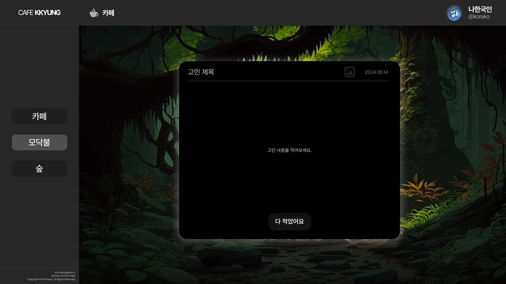

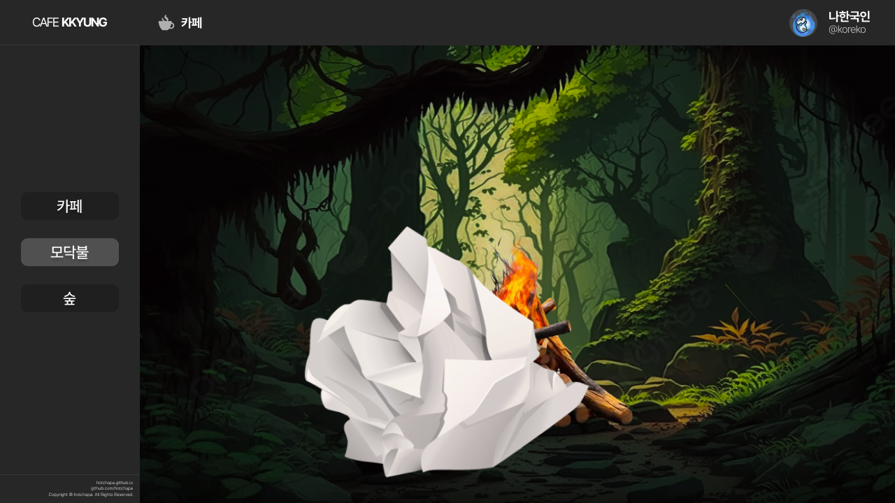

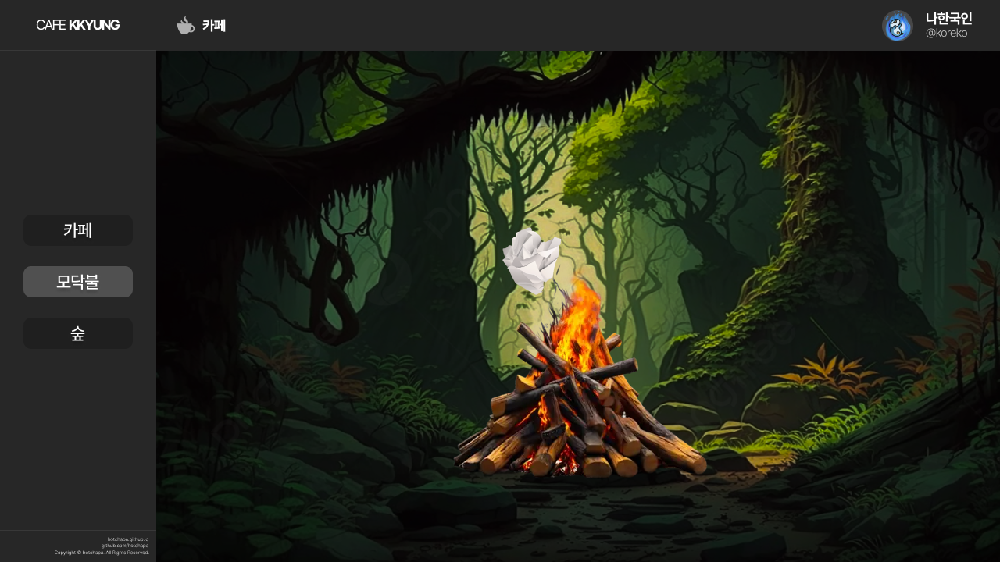

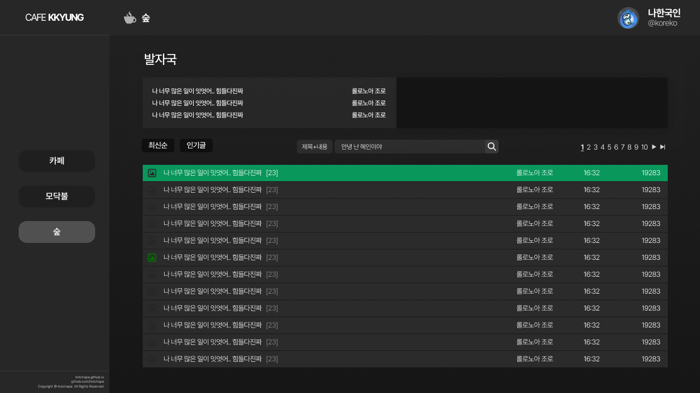

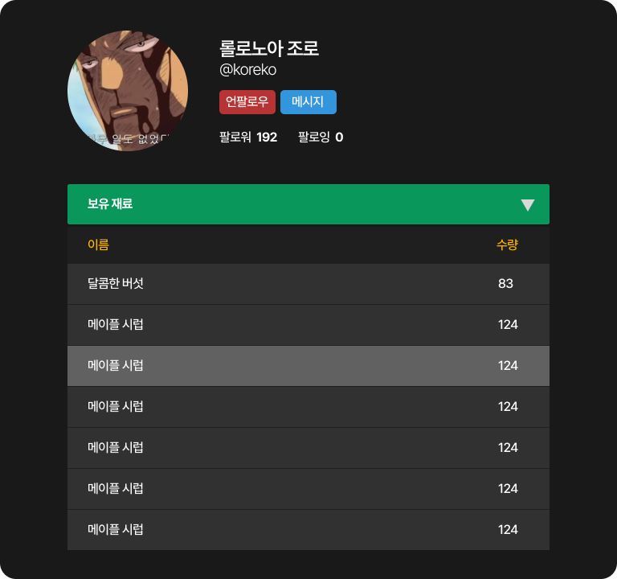
 
대략적인 기능은 아래와 같다.
 

1) 뀽뀽이와 상호작용 : 뀽뀽이에게 재료를 건내주고, 완성된 카페 음식 건네받기. 재료가 없어도 음식을 받을 수 있음.
   
2) 고민 처리 및 태우기 이벤트 : 평소 고민을 적고, 바로 모닥불에 던져서 불태워 버리기. 만약 고민이 해결되지 않았으면 보관함에 두기 (기본 적으로 고민은 비공개) 보관된 고민은 게시판에 공개할 수 있음

3) 커뮤니티 기능 : 게시판과 메시지, 프로필, 팔로우 기능이 존재. 게시판은 일반적인 커뮤니티와 같으나, 주제가 고민거리로 지정 되어있음.
   
4) 미니 게임 기능 : 카페에 쓰일 재료 구하기를 게임을 통해 구할 수 있음.

 

기능은 실제 개발을 하면서 변경될 부분이 있을 것이다.

하지만 새로운 프로젝트의 방향성은 사용자에게 더 깊이 다가가고, 실질적인 가치를 제공하는 데 초점을 맞추고 있다. 이 점을 명확히 하고 있으니,적어도 기존 프로젝트처럼 갈아엎는 경우는 이젠 없을 것이다. 

꼭 사용자의 일상 속에서 작은 쉼터가 되어줄 수 있는 서비스가 되기를 바란다.
    

