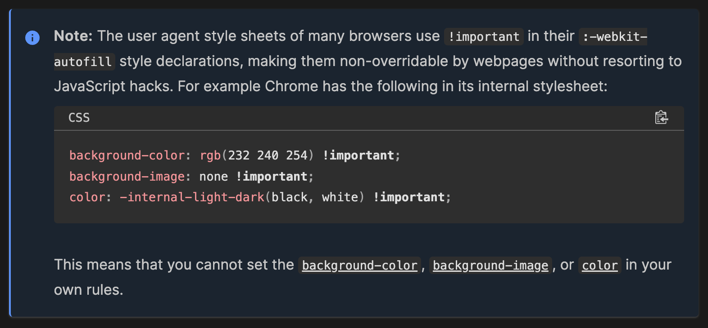

## 이슈


위와 같이 브라우저의 자동완성 기능을 이용할 때,
의도하지 않은 배경색이 덮어씌워지는 문제가 발생했다.

## 원인



MDN을 살펴보니, 브라우저의 에이전트 스타일이 자동완성된 입력 필드에 강제로 적용되는 것이 원인이었다. 여기서 `에이전트 스타일시트(Agent Stylesheet)`는 웹 브라우저가 HTML 문서를 표시할 때 기본적으로 사용하는 스타일시트를 의미한다. 각 브라우저는 자체적으로 정의된 에이전트 스타일시트를 가지고 있다는 것이다.

크롬의 경우, 사용자가 자동완성된 필드를 시각적으로 쉽게 인식할 수 있도록 특정 스타일을 적용하는데, 그 스타일이 적용되는 바람에 위와 같은 이슈가 발생한 것이다.

더 큰 문제는,`background-color`와 `color` 속성이 `!important`로 설정되어 있어 스타일을 덮어씌울 수 없게 되어있다는 것이다.

예를 들어 `&:-webkit-autofill` css 선택자를 이용해서, 자동완성 필드에 대한 스타일을 직접 지정한다면,

```jsx
 &:-webkit-autofill,
  &:-webkit-autofill:hover,
  &:-webkit-autofill:focus,
  &:-webkit-autofill:active {
	      background-color: ${({ theme }) => theme.color.dark};
  }
```

`background-color` 에 색을 지정해도, 먹혀들지 않고 여전히 에이전트 스타일이 적용된다는 것!

```tsx
# 참고
- &:-webkit-autofill: 입력 필드가 자동완성 데이터를 채울 때 텍스트 색상과 배경색을 지정함
- &:-webkit-autofill:hover: 자동완성된 입력 필드를 마우스로 가리킬 때도 동일한 스타일을 적용함
- &:-webkit-autofill:focus: 자동완성된 입력 필드에 포커스가 맞춰졌을 때도 동일한 스타일을 적용함
- &:-webkit-autofill:active: 자동완성된 입력 필드가 활성화된 상태에서도 동일한 스타일을 적용함
```

## 해결방법

`background-color`와 `color` 속성이 `!important`로 인해 바뀔 수 없다면 우회방법이 필요하다. 두 가지 우회법을 소개한다.

### 1) -webkit-box-shadow, -webkit-text-fill-color

```jsx
  &:-webkit-autofill,
  &:-webkit-autofill:hover,
  &:-webkit-autofill:focus,
  &:-webkit-autofill:active {
    background-color: ${({ theme }) => theme.color.dark};
    -webkit-text-fill-color: ${({ theme }) => theme.color.text};
    -webkit-box-shadow: 0 0 0px 10px ${({ theme }) => theme.color.dark} inset;
  }
```

`-webkit-text-fill-color` 는 웹킷 기반의 브라우저(예: Chrome, Safari)에서 텍스트의 색상을 지정하는 데 사용되는 CSS 속성이라, color와는 다른 속성이다. 즉, Impotant의 영향을 받지 않고 텍스트 색을 지정할 수 있게 된다.

`-webkit-box-shadow` 속성은 입력 필드 내부에 큰 그림자를 생성하여 필드의 배경을 덮는다. 이 그림자는 필드의 전체 영역을 덮기 때문에 브라우저 기본 배경 색상이 보이지 않게 되고, `inset` 으로, 외부가 아닌 내부에 그림자가 적용되게 하는 것도 포인트다.

단, 위 방법은 그림자에 의존하는 우회법이므로, 만약 지정한 그림자의 크기가 필드를 덮기에 부족하거나, 에이전트 스타일이 플러그인이나 업데이트로 인해 변화했을 때, 대응하기 힘들 수도 있다. 그래서 `transition` 우회법을 더해서 사용한다.

### 2) transition 우회법

```jsx
transition: background-color 5000s ease-in-out 0s;
```

`background-color` 속성을 통해, 배경색 전환이 5000초에 걸쳐 일어나게 하여, 사용자가 체감하기 어렵게 만드는 것이다. 이렇게 하면 `-webkit-box-shadow` 속성이 제 역할을 하지 못하더라도, 변화 자체를 감지하기 어렵게 할 수 있다.

즉 다양한 브라우저와 다양한 버전 간의 호환성을 확보하기 위한 방안으로, 특정 브라우저나 버전에서 예상치 못한 동작을 방지할 수 있다.


굳이 5000초로 설정한 이유는 위와 같이 5초로 설정하면 사용자가 변화를 쉽게 감지할 수 있기 때문이다.

## 해결완료

```jsx
const SearchInput = styled.input`
  flex: 1;
  height: 2em;
  border: none;
  background: transparent;
  color: ${({ theme }) => theme.color.text};
  font-size: ${({ theme }) => theme.fontsize.body1};
  &:focus {
    outline: none;
  }
  &:-webkit-autofill,
  &:-webkit-autofill:hover,
  &:-webkit-autofill:focus,
  &:-webkit-autofill:active {
    -webkit-text-fill-color: ${({ theme }) => theme.color.text};
    -webkit-box-shadow: 0 0 0px 10px ${({ theme }) => theme.color.dark} inset;
    transition: background-color 5000s ease-in-out 0s;
  }
`;
```

이렇게 적용하고나니,


정상적으로 의도한 배경색이 보이고 이슈가 해결됐다 !
