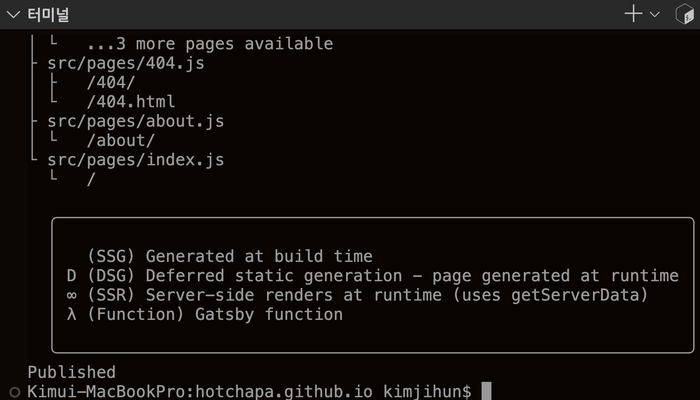
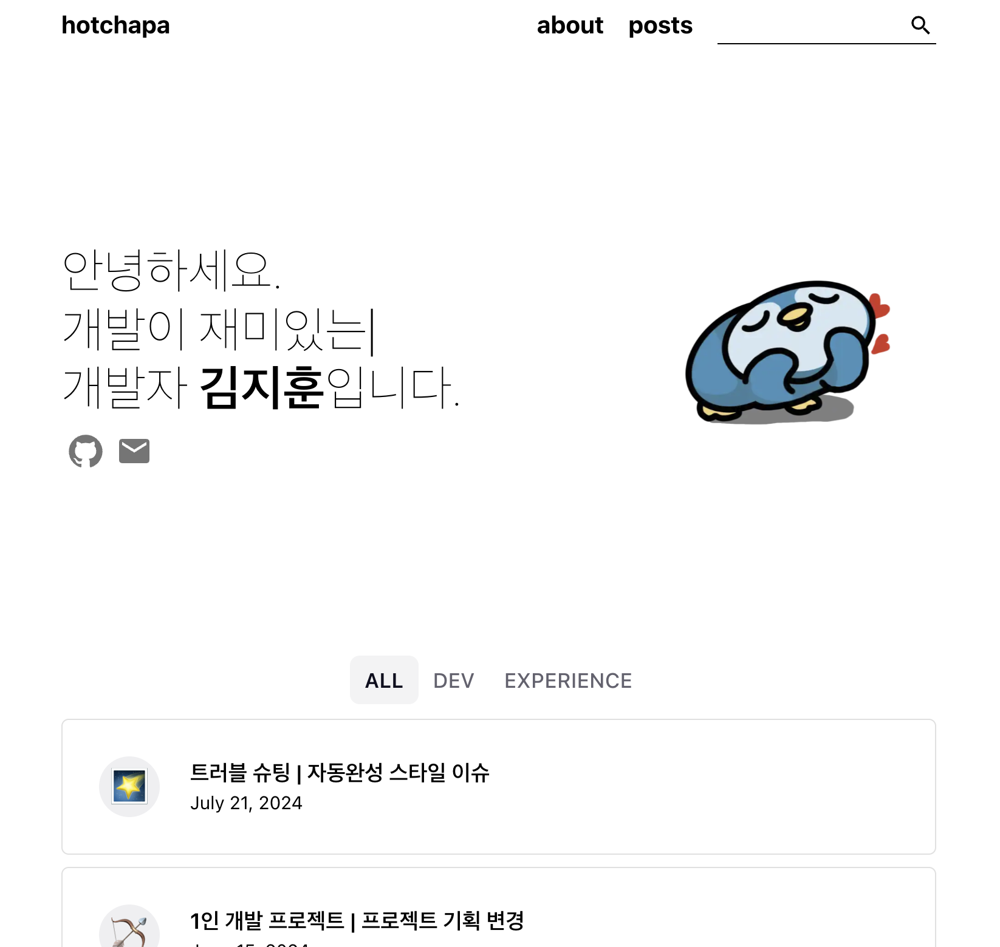
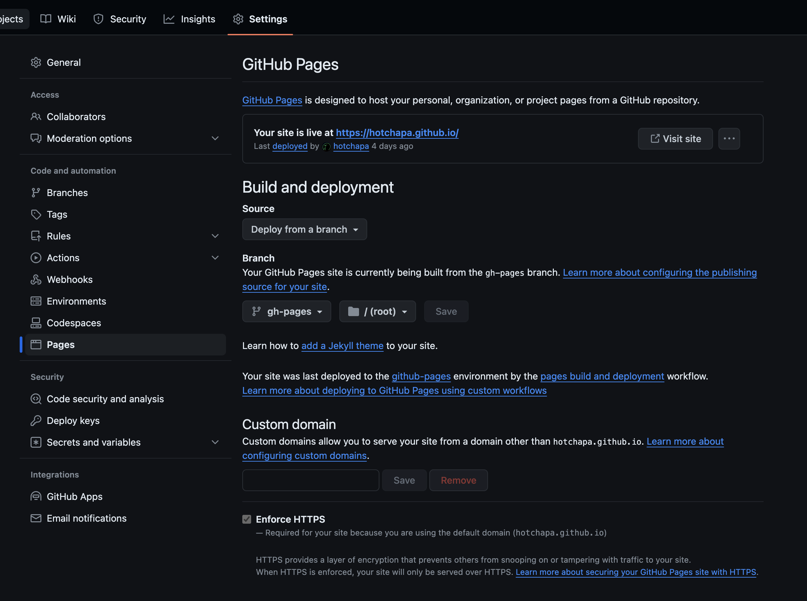
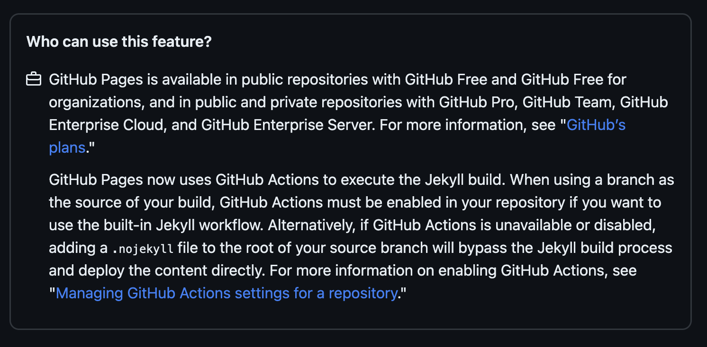
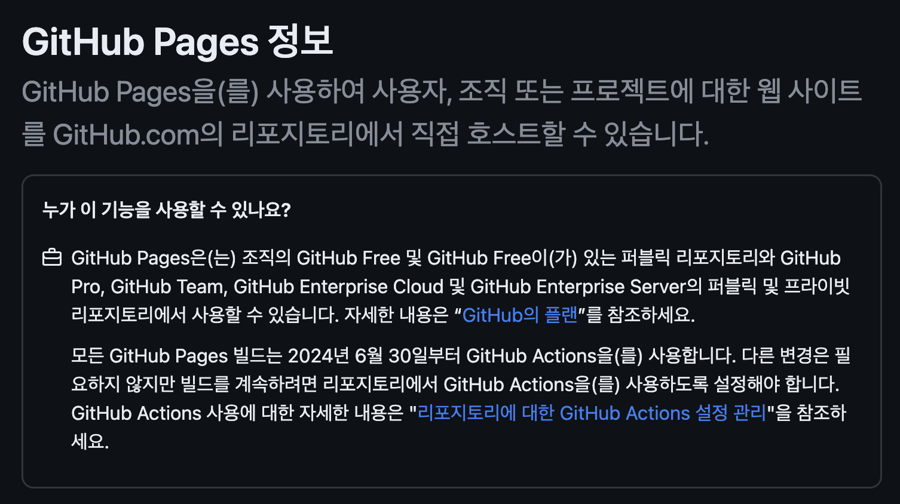
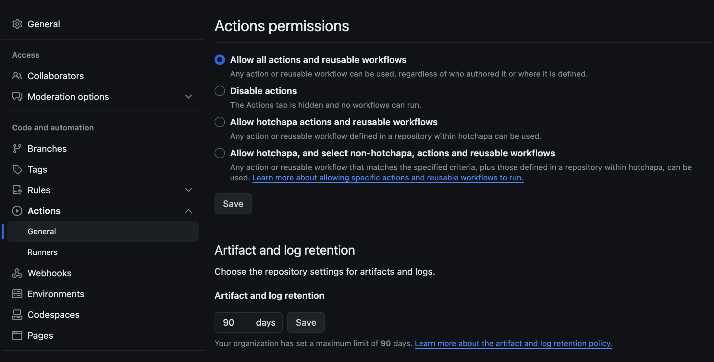
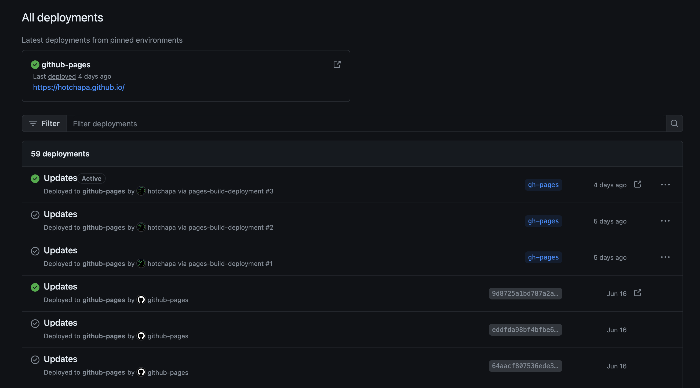

## 이슈

깃허브 블로그에 새로운 포스팅을 하고 배포했는데, 블로그에 들어가도 새로운 포스트가 나타나지 않았다.

## 원인

현재 나는 `gh-pages` 라이브러리와 GitHub Pages를 사용해서 배포중이다. 배포 과정에 문제가 있겠다 싶어 터미널 창에 에러가 있는지 살펴봤는데, 오히려 제대로 배포가 성공했음을 알리는 `Published`를 출력하고 있었다. 혹시나해서 새로 작성한 문서에 누락한 `metadata`가 있는지도 살펴봤는데, 이것도 아니었다. author, tags, date, title.. 등등 전부 제대로 기입해놨다.

결국 `npm run develop` 으로 로컬환경에서 테스트해보니 제대로 출력되고 있었다. 이쯤되니 GitHub Pages 자체에 문제가 생긴 게 아닌가 하는 생각이 들었다.

간만에 GitHub Pages 설정 페이지에 들어가보니, `GitHub Actions`를 활성화하라는 안내창이 나타나고 있었다. 아쉽게도 그당시 스크린샷을 찍지 못해서, 깃허브 공식문서에 나타난 안내문을 가져왔다.

GitHub 페이지에서 브랜치를 빌드 소스로 사용할 때, 내장된 `Jekyll` 워크 플로우를 사용하려면 `GitHub Actions`를 사용하라고 안내하고 있다.

또, 모든 GitHub Pages 빌드가 6월 30일부터 `GitHub Actions`를 사용하게 변경됐다고 한다. 기존에는 Pages 탭에서 GitHub Actions을 활성화하지 않아도 Source와 Branch만 설정해주면 알아서 배포가 됐는데, 이젠 그렇지 않다는 것이다.

마지막으로 배포 성공했던 날이 6월 15일이었던 걸 생각하면, 그때는 배포를 성공하고, 지금은 실패한 이유가 설명된다. 이제 원인을 알았으니 해결방법은 간단하다.

## 해결

`Actions permissions`에서 액션 사용 허가를 내려주면 끝이다. 이러고 다시 `npm run deploy` 명령어로 배포를 하고나니,

정상적으로 배포됐다.

이번 문제는 GitHub Pages의 배포 방식 변경을 미처 알지 못해 발생했다. 라이브러리 뿐만 아니라, GitHub 같은 플랫폼도 배포 방식, 보안 정책 등의 변경 사항을 공지하는데, 이런 변경사항을 주기적으로 확인하는 습관이 필요하겠다는 생각이 든다.
