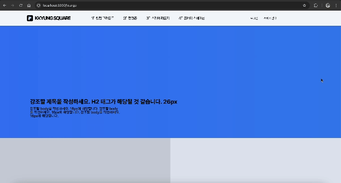
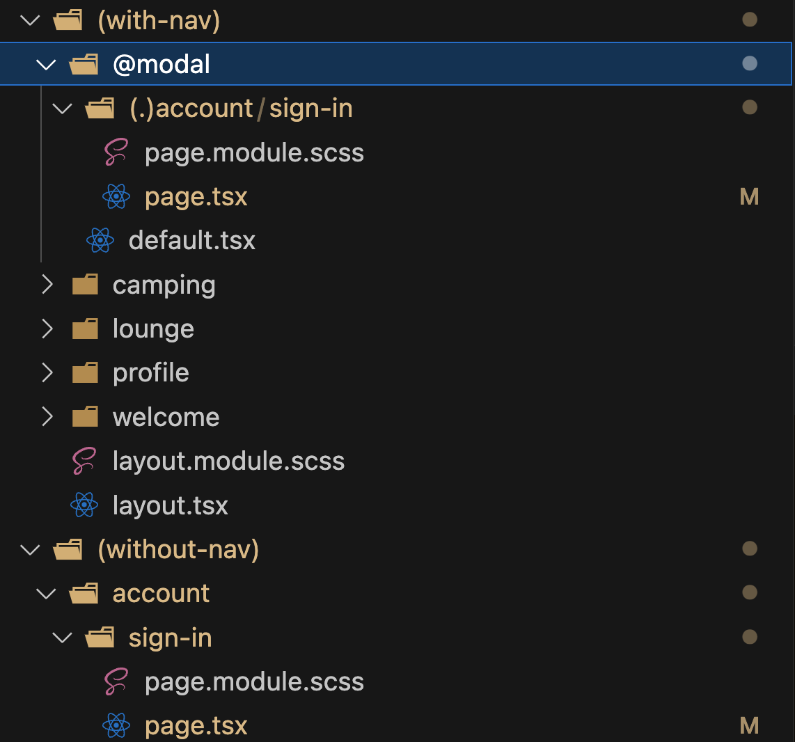

## Parallel Routes와 Intercepting Routes

Next에서는 사용자 경험을 향상시키기 위한 기능으로 **Parallel Routes**와 **Intercepting Routes**를 고려할 수 있다. 이 두 기능은 서로 다른 레이아웃이나 페이지 내에서 다양한 경로를 효율적으로 관리하고 표시하는 데 유용하다.

### Parallel Routes

- **복잡한 레이아웃**: 페이지의 서로 다른 부분이 독립적으로 데이터를 가져와야 하며, 서로 다른 상태를 가질 때 유용하다.
- **향상된 성능**: 컴포넌트와 데이터를 병렬로 로드하여 페이지가 상호작용 가능해지는 시간을 줄인다.
- **개선된 사용자 경험**: 페이지의 일부가 로드되는 동안 다른 부분을 사용할 수 있게 하여 매끄러운 경험을 제공한다.

### Parallel Routes의 사용 사례

- **대시보드**: 다양한 위젯이나 패널이 독립적으로 데이터를 로드하는 경우
- **전자상거래 사이트**: 제품 정보, 추천 상품, 리뷰 등을 동시에 표시하는 경우
- **소셜 미디어 플랫폼**: 피드, 알림, 메시지가 개별 컴포넌트로 업데이트되는 경우

### Intercepting Routes

**Intercepting Routes**를 사용하여 특정 경로 변경을 다르게 처리할 수 있다. 이를 통해 현재 페이지에서 벗어나지 않고 모달을 표시하는 등의 기능을 구현할 수 있다.

- **맥락 유지**: 사용자가 로그인이나 회원가입 등의 작업을 수행하면서도 현재 페이지의 맥락을 잃지 않도록 한다.
- **원활한 전환**: 전체 페이지를 다시 로드하지 않고 상태를 유지하여 성능을 향상시킨다.
- **일관된 UI**: 메인 콘텐츠를 유지하면서 추가 기능을 오버레이 형태로 제공하여, 일관된 사용자 경험을 제공한다.

### Intercepting Routes의 사용 사례

- **인증 모달**: 현재 페이지 위에 로그인이나 회원가입 양식을 오버레이하는 경우
- **빠른 보기**: 제품 목록에서 벗어나지 않고 제품 정보를 모달로 보는 경우
- **인라인 편집**: 원본 보기의 맥락을 유지하면서 콘텐츠를 모달에서 편집할 수 있도록 하는 경우

### 사용자 경험에 미치는 영향

`Parallel 및 Intercepting Routes`의 전략적인 사용은 다음과 같이 사용자 경험을 크게 향상시킬 수 있다.

- **즉각적인 피드백 제공**: 사용자에게 빠른 응답을 제공하고 부분적으로 콘텐츠를 즉시 표시한다.
- **인지 부하 감소**: 사용자가 작업을 수행한 후에도 현재 위치와 작업의 맥락을 쉽게 이해할 수 있도록 한다.
- **탐색 흐름 향상**: 불필요한 페이지 새로고침 없이 콘텐츠를 탐색할 수 있도록 한다.

### 결론

`Parallel과 Intercepting Routes`는 사용자 경험을 향상시키기 위한 강력한 기능이다. 잘만 활용하면 사용자에게 보다 직관적이고 끊김 없는 경험을 제공할 수 있으며, 특히 사용자 이탈을 방지하고 원활한 작업 수행을 지원할 수 있다.

---

## 의문점과 문제점

기능을 사용하면서 다음과 같은 의문점들이 들어서 몇 가지 정리해보았다.

### 의문점 1

공통 내비게이션 바의 로그인 버튼을 누르면, 인터셉팅이 일어나 로그인 주소에 있는 로그인 페이지를 렌더하는 게 아니라, 패러렐 라우팅 중인 로그인 모달을 렌더링 하도록 조치해놨다고 가정하자.

이런 경우, 내비게이션 바의 로그인 버튼을 클릭하면, Intercepting과 Parallel Routing이 적용되어, 주소창이 `/article/1` 에서 `/account/sign-in` 과 같이 로그인 주소로 바뀌지만, article 페이지의 화면이 유지된 상태로 모달이 띄워질 것이다.

### 의문에 대한 답

**이때, 모달이 띄워진 상태에서 또 다른 주소로 이동한 뒤 뒤로가기를 하면 어떻게 될까?**

- 사용자가 다른 페이지로 이동했다가 뒤로가기를 누르면, 브라우저의 히스토리에 따라 이전 상태로 돌아간다.
- 이 때, `/article/1` 페이지로 돌아오게 되고, 로그인 모달이 다시 띄워진다.
- 즉, 페이지의 상태와 스크롤 위치는 유지되며, 모달도 그대로 다시 나타난다.

**다시 돌아가서, 모달이 띄워진 상태에서 또 다른 주소로 이동한 뒤 새로고침을 하면 어떻게 될까?**

- 사용자가 새로고침을 하면, 현재의 URL(`/account/sign-in`)에 해당하는 페이지가 다시 로드된다.
- 이 경우, 모달 상태가 아닌 실제 로그인 페이지가 로드된다.
- 새로고침을 했기 때문에, URL에 해당하는 리소스를 새로 요청하게 되고, 페이지 상태가 초기화되며 Parallel Routing에 의한 상태 보존 기능이 상실된다.

### 의문점 2

모달은 일반적으로 `isModalOpen`과 같은 상태로 열림 여부를 판단하고 조건부 렌더링한다. 실제로 이전 프로젝트에도 이런 식으로 구현해왔다. 이 경우, 주소가 변하지 않고 페이지에 오버레이로 표시된다. 그럼 굳이 인터셉팅과 패러렐을 쓰면서까지 모달을 구현할 이유가 뭘지 궁금해졌다. 맥락 유지나 성능 개선 말고도 다른 이유가 있지 않을까?

### 의문에 대한 답

1. **모바일 환경, 그 중에서도 안드로이드 사용자를 위한 UX 개선을 이룰 수 있다.**

   PC 환경에서는 창 닫기 버튼을 클릭하는 것이 더 편리하기 때문에 이러한 문제가 적지만, 모바일 특히 안드로이드에서는 뒤로가기 버튼을 사용하는 경향이 강하다. 이 경우, 모달을 뒤로 가기로 닫으려 할 때 의도치 않게 이전 페이지로 이동하게 된다.

   하지만 인터셉팅 라우팅과 패러렐 라우팅을 사용하면 모달이 열릴 때 URL을 업데이트하여 브라우저 히스토리에 기록된다. 이렇게 하면 사용자가 뒤로 가기 버튼을 눌렀을 때, 모달을 닫는 액션으로 연결되어 뒤로 가기만으로도 모달을 닫을 수 있게 된다.

   물론, `handlePopState`와 `window.history.pushState`를 활용해도 뒤로 가기 제스처를 모달 닫기 액션으로 이어지게 조치할 수 있다. 하지만 이 경우, 모달이 URL로 관리되는 것이 아니니까 특정 모달 상태를 다른 사용자와 쉽게 공유할 수 없게 된다.

2. **다중 모달 처리가 가능하다.**

   여러 모달을 동시에 열거나 특정 순서로 다뤄야 할 때, URL을 통해 모달 상태를 관리하면 사용자가 보다 직관적으로 인터페이스를 탐색할 수 있다. 각 모달의 상태가 명확하게 구분되므로, 사용자 흐름을 더 체계적으로 구성할 수 있다.

### 의문점 3

링크를 통해 sign-in 페이지에 접속했을 때, `(without-nav)` 라우팅 그룹에 속한 `account/sign-in/page.tsx` 대신, `(with-nav)` 라우팅 그룹의 `account/sign-in/page.tsx` 모달이 나타나게 할 수 있을까?

### 의문에 대한 답

가능하다. 이를 위해 경로 설정을 **세그먼트 기준**으로 정확히 해야 한다.

Intercepting Routes는 `(..)` 구문을 사용하여 경로를 정의한다. 이는 라우팅 그룹(`()`)이나 슬롯(`@`)이 세그먼트로 취급되지 않기 때문에, 세그먼트를 정확히 지정할 수 있도록 해준다.

- **`(.)`**: 현재 수준의 세그먼트와 일치한다. 즉, 현재 경로의 동일한 디렉토리 수준에서 경로를 찾을 때 사용한다.
- **`(..)`**: 한 수준 위의 세그먼트와 일치한다. 부모 디렉토리로 이동하여 그 수준에서 경로를 탐색한다.
- **`(..)(..)`**: 두 수준 위의 세그먼트와 일치한다. 두 단계 위의 부모 디렉토리에서 경로를 찾을 때 사용한다.
- **`(...)`**: 루트 앱 디렉토리부터의 절대 경로를 지정한다. 애플리케이션의 최상위 디렉토리부터 시작하여 경로를 명확히 설정할 수 있다.

### 예시

위와 같은 폴더 구조일 때, 세그먼트 기준에 맞게 경로를 설정하면 원하는 라우팅을 구현할 수 있다.
