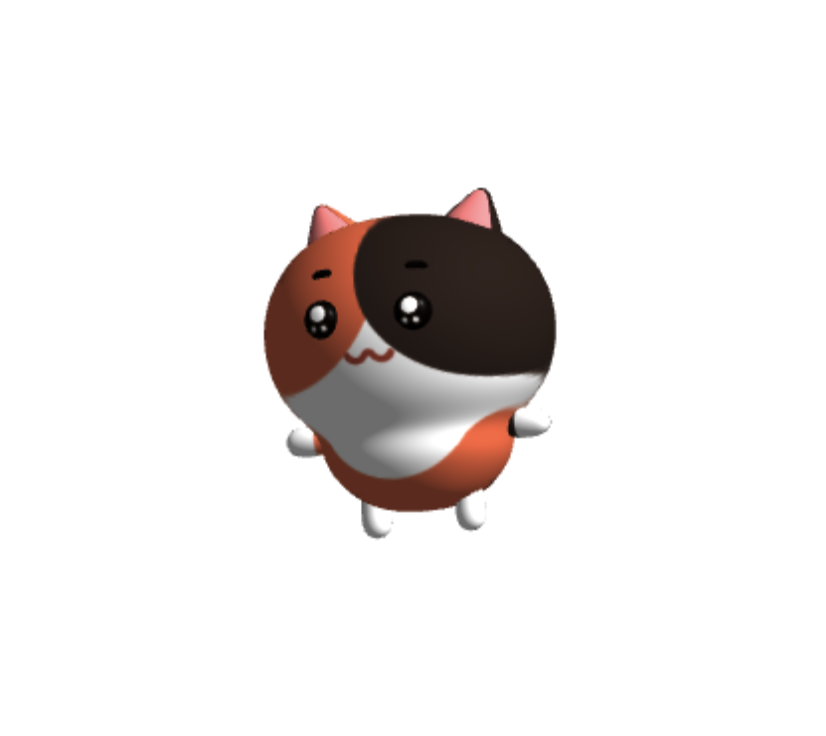

HTML5가 도입된 이후, 웹에서 그래픽을 동적으로 처리하는 수단으로 `<canvas>`가 주목받기 시작했다. 게임, 데이터 시각화, 애니메이션 등 다양한 분야에서 사용되며, 2D뿐만 아니라 3D 그래픽 처리까지 가능하다. 이번 포스팅에서는 **canvas의 탄생 배경과 특징**, 그리고 **모던 웹 개발에서의 활용 사례**를 살펴보자.

## 탄생 배경

HTML5의 `<canvas>`는 플러그인 없이 브라우저에서 그래픽을 그릴 수 있는 기술로 등장했다. 예전에는 Flash나 Silverlight 같은 외부 플러그인에 의존해 리치 미디어를 구현해야 했지만, HTML5와 자바스크립트만으로 인터랙티브한 그래픽을 처리할 수 있는 환경이 필요해지면서 `<canvas>`가 그 대안으로 등장하게 됐다.

## 주요 특징

- **2D 및 3D 그래픽** 렌더링 가능
- **픽셀 기반** 동적 그래픽 처리
- 자바스크립트를 통해 실시간 애니메이션, 게임, 데이터 시각화 구현 가능

## 사용법

### 1) 기본적인 사용 예시

간단한 `<canvas>` 사용 예제를 살펴보자. 자바스크립트로 동적으로 그래픽을 그린다.

```html
<canvas id="myCanvas" width="200" height="200"></canvas>
<script>
  var canvas = document.getElementById('myCanvas');
  var ctx = canvas.getContext('2d');
  ctx.fillStyle = 'blue';
  ctx.fillRect(10, 10, 100, 100);
</script>
```

위 코드는 `<canvas>`에 파란색 사각형을 그린다. `getContext('2d')`를 호출하여 2D 그래픽을 다룰 수 있고, `fillRect()`를 이용해 사각형을 그린다.

### 2) 애니메이션 구현

```jsx
function draw(timestamp) {
  const x = (timestamp / 10) % 600;
  ctx.clearRect(0, 0, 600, 50);
  ctx.fillRect(x, 0, 50, 50);
  window.requestAnimationFrame(draw);
}
```

`requestAnimationFrame()`은 브라우저가 다음 화면을 그리기 전에 호출하는 콜백 함수로, 이를 활용해 자연스러운 애니메이션을 구현할 수 있다. 호출될 때마다 브라우저가 `timestamp` 값을 자동으로 제공한다.

## 용례

### 1) 게임 개발

`<canvas>`는 브라우저 기반의 2D, 3D 게임 개발에 자주 사용된다. 특히 `requestAnimationFrame()`과 결합하면 실시간 렌더링이 가능해, 동적인 게임을 쉽게 구현할 수 있다.

### 2) 데이터 시각화

차트, 그래프 등 데이터를 시각적으로 표현하는 데에도 유용하다. 특히 Chart.js, D3.js와 같은 라이브러리와 함께 사용하면 복잡한 데이터도 깔끔하게 시각화할 수 있다.

### 3) 이미지 편집 도구

픽셀 단위로 세밀한 작업이 가능해 이미지 처리나 필터 적용, 자르기 등도 `<canvas>`를 통해 구현할 수 있다.

## 모던 웹 개발 환경에서의 활용

canvas는 2D 그래픽뿐 아니라, WebGL을 통해 3D 그래픽도 구현할 수 있다. 다만 WebGL을 직접 사용하려면 `<canvas>` 요소에 렌더링 컨텍스트를 관리하고, 셰이더 프로그램을 작성해야 하는 등 복잡한 작업이 필요하다.

```jsx
const canvas = document.createElement('canvas');
const gl = canvas.getContext('webgl');
document.body.appendChild(canvas);

// 셰이더 및 버퍼 설정
const vertexShader = gl.createShader(gl.VERTEX_SHADER);
gl.shaderSource(vertexShader, vertexShaderSource);
gl.compileShader(vertexShader);

const fragmentShader = gl.createShader(gl.FRAGMENT_SHADER);
gl.shaderSource(fragmentShader, fragmentShaderSource);
gl.compileShader(fragmentShader);

const shaderProgram = gl.createProgram();
gl.attachShader(shaderProgram, vertexShader);
gl.attachShader(shaderProgram, fragmentShader);
gl.linkProgram(shaderProgram);
gl.useProgram(shaderProgram);

// 버퍼와 애트리뷰트 설정
const positionBuffer = gl.createBuffer();
gl.bindBuffer(gl.ARRAY_BUFFER, positionBuffer);
gl.bufferData(gl.ARRAY_BUFFER, new Float32Array(vertices), gl.STATIC_DRAW);
```

### Three.js에서의 활용

WebGL의 복잡성을 해결하기 위해, **Three.js**와 같은 라이브러리가 등장했다. Three.js는 복잡한 설정 작업을 추상화하여 간단한 API로 3D 모델을 렌더링하고 사용자 상호작용을 처리할 수 있게 도와준다.

```jsx
import { useRef, useEffect } from 'react';
import * as THREE from 'three';

const ThreeCanvas = () => {
  const canvasRef = useRef(null);

  useEffect(() => {
    const canvas = canvasRef.current;
    const scene = new THREE.Scene();
    const camera = new THREE.PerspectiveCamera(
      75,
      window.innerWidth / window.innerHeight,
      0.1,
      1000,
    );
    const renderer = new THREE.WebGLRenderer({ canvas });
    renderer.setSize(window.innerWidth, window.innerHeight);

    const geometry = new THREE.BoxGeometry();
    const material = new THREE.MeshBasicMaterial({ color: 0x00ff00 });
    const cube = new THREE.Mesh(geometry, material);
    scene.add(cube);

    camera.position.z = 5;

    function animate() {
      requestAnimationFrame(animate);
      cube.rotation.x += 0.01;
      cube.rotation.y += 0.01;
      renderer.render(scene, camera);
    }

    animate();
  }, []);

  return <canvas ref={canvasRef}></canvas>;
};

export default ThreeCanvas;
```

## canvas 최적화 방법

### 1. **ImageBitmap**을 활용한 최적화

`ImageBitmap`은 큰 이미지를 렌더링할 때 성능을 개선하는 데 유용하다.

```jsx
const img = new Image();
img.src = 'image.png';

img.onload = () => {
  createImageBitmap(img).then((bitmap) => {
    const canvas = document.getElementById('myCanvas');
    const ctx = canvas.getContext('2d');
    ctx.drawImage(bitmap, 0, 0);
  });
};
```

`ImageBitmap`을 사용하면 큰 이미지를 `<canvas>`에 빠르게 그릴 수 있다. 하지만 모든 브라우저가 지원하는 것은 아니므로 호환성을 고려해야 한다.

### 2. **OffscreenCanvas**를 활용한 성능 개선

`OffscreenCanvas`는 **다른 스레드에서** 렌더링을 처리하여 성능을 크게 향상시킬 수 있다. 특히 **웹 워커**와 함께 사용하면 효과적이다.

```jsx
const offscreen = canvas.transferControlToOffscreen();
const worker = new Worker('worker.js');

worker.postMessage({ canvas: offscreen }, [offscreen]);

// worker.js에서
self.onmessage = function (event) {
  const canvas = event.data.canvas;
  const ctx = canvas.getContext('2d');
  ctx.fillRect(10, 10, 100, 100);
};
```

### 결론

결론적으로, canvas는 `"코드로 그림을 그리는"` Web API다. 그러나 프론트엔드 개발자로서 중요한 것은 **무엇을 그릴 것인가?** 가 아니라, **어떻게 빠르고 매끄럽게 그릴 것인가?** 다. 사용자가 실시간으로 인터랙션할 때, 웹 애플리케이션이 지연 없이 빠르게 반응하는 것은 성능 최적화에 달려 있다는 거다.

특히, 브라우저의 리렌더링 주기인 16.67ms(60fps)에 맞춰 애니메이션을 처리하는 것이 중요하다. 하지만 자바스크립트 엔진이 오직 canvas 작업만 하는 것은 아니므로, 그보다 더 빠르게 최적화해야 한다. 이를 위해 requestAnimationFrame을 활용해 브라우저의 렌더링 타이밍에 맞춰 화면을 그리거나, OffscreenCanvas와 ImageBitmap 등을 통해 메인 스레드의 부하를 줄여야 한다.

결국, 프론트엔드 개발자로서 핵심 과제는 기능적 구현과 성능 최적화를 동시에 고려하는 것이다. 멋진 그래픽을 그려내는 것도 중요하지만, 그것을 얼마나 효율적으로 보여줄 수 있는가가 사용자 경험의 차이를 만든다고 생각한다.
