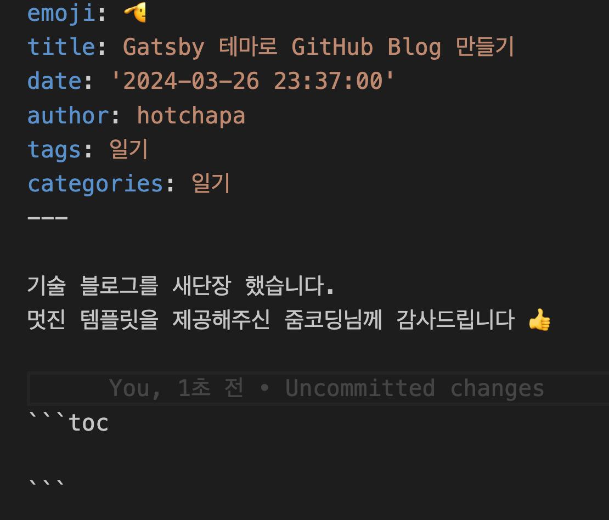

# ERROR #85901  GRAPHQL 오류
들뜬 마음으로 블로그 기본 설정을 수정한 뒤 배포를 하려했더니
아래와 같은 에러가 나타났는데요 ,,

```
  There was an error in your GraphQL query:

Cannot read properties of null (reading 'children')

File: gatsby-node.js:61:19


  TypeError: Cannot read properties of null (reading 'children')
  
  - index.js:63 visit
    [hotchapa.github.io]/[unist-util-visit-parents]/index.js:63:16
  
  - index.js:67 visit
    [hotchapa.github.io]/[unist-util-visit-parents]/index.js:67:75
  
  - index.js:29 visitParents
    [hotchapa.github.io]/[unist-util-visit-parents]/index.js:29:26
  
  - index.js:22 visit
    [hotchapa.github.io]/[unist-util-visit]/index.js:22:3
  
  - index.js:43 module.exports
    [hotchapa.github.io]/[gatsby-remark-prismjs]/index.js:43:3
  
  - extend-node-type.js:290 parseString
    [hotchapa.github.io]/[gatsby-transformer-remark]/extend-node-type.js:290:17
  
  - extend-node-type.js:243 getAST
    [hotchapa.github.io]/[gatsby-transformer-remark]/extend-node-type.js:243:29
  
  - extend-node-type.js:530 getExcerptPlain
    [hotchapa.github.io]/[gatsby-transformer-remark]/extend-node-type.js:530:19
  
  - async Promise.all
  
  - async Promise.all
  
  - async Promise.all
  
  - async Promise.all
  
  - async Promise.all
  
  - graphql-runner.ts:220 GraphQLRunner.query
    [hotchapa.github.io]/[gatsby]/src/query/graphql-runner.ts:220:14
  
  - create-pages.ts:36 wrappedGraphQL
    [hotchapa.github.io]/[gatsby]/src/services/create-pages.ts:36:25
  
  - gatsby-node.js:61 Object.exports.createPages
    /Users/kimjihun/hotchapa.github.io/gatsby-node.js:61:19
  

  not finished createPages - 0.065s

  Kimui-MacBookPro:hotchapa.github.io kimjihun$ /Users/kimjihun/hotchapa.github.io/node_modules/yoga-layout-prebuilt/yoga-layout/build/Release/nbind.js:53
```

역시 첫 술에 배부르긴 힘든 일이구나 싶네요 허허
빨리 바뀐 블로그를 보고 싶으니 바로 해결하기로 했습니다.

children 이라는 말에서 살짝 힌트를 얻었는데, 
뭔가 참조할 게 없으니까 에러가 뜨는 게 아닐까 싶었는데요.



역시나, 목차를 나타낼 수 있는 기능인 toc를 꺼주면 해결 가능했습니다!
큰 에러가 아니라서 다행이었네요 ㅎㅎ


