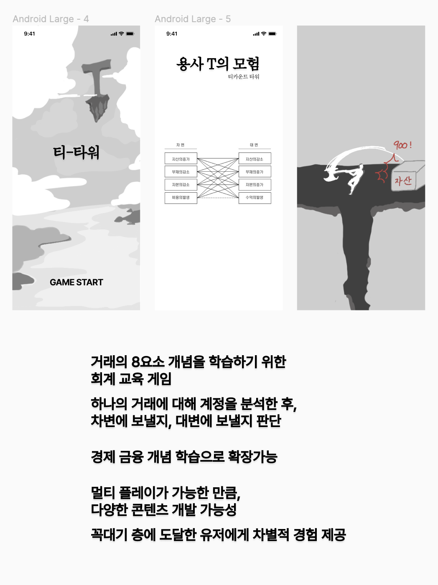
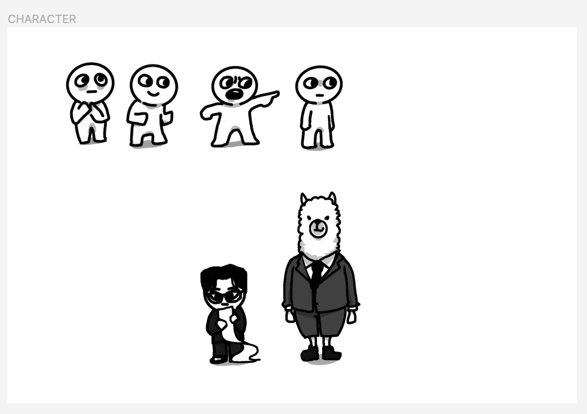
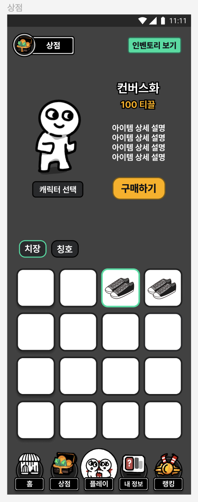
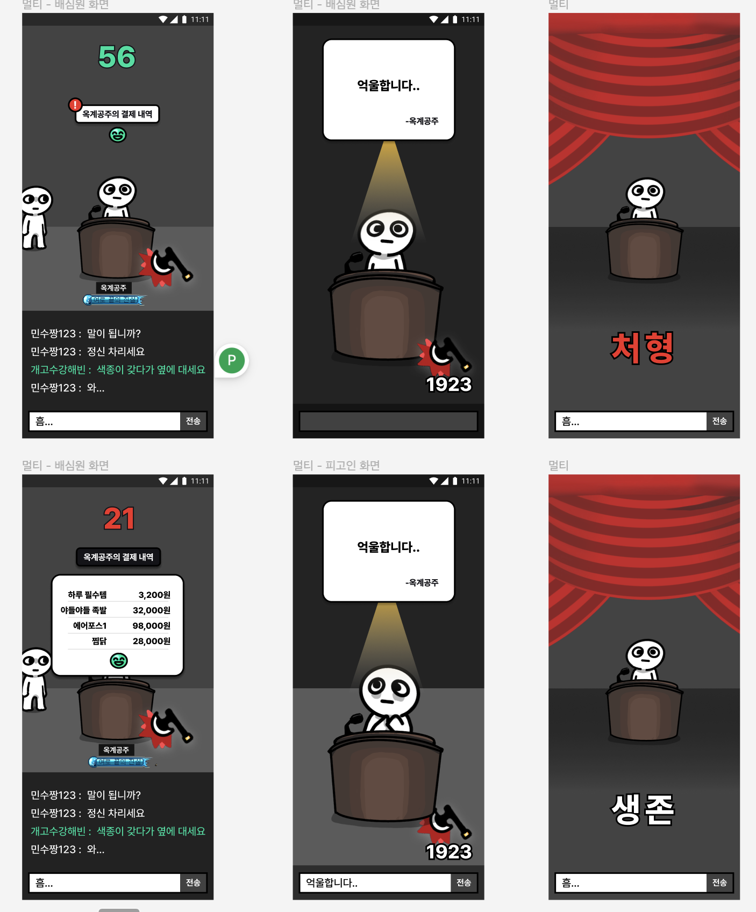
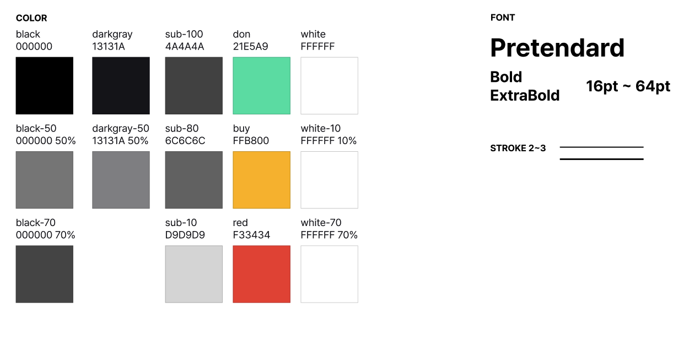

## 거지먼트의 어원?
거지먼트는 거지와 저지먼트의 합성어로, 사실 초기기획 단계에 구상했던 게임 아이디어에 더 적합한 이름이었습니다.
초기 기획안을 조금 공개하자면, 아래와 같습니다.

---
### **💸만원의 행복 거지방 (가제)**

- **홈**
    - 개인 캐릭터 (클릭 시 인벤토리로 이동)
    - 칭호 (업적)
    - 상단에 랭킹포인트랑 리워드
    - 하단 네비게이션 탭바 (홈, 플레이, 상점, 명예의 전당, 마이페이지)

- **플레이**
    - **멀티**
        
        : 소비를 카카오 친구끼리 다인원으로 대결 플레이 (최대 인원수 제한(2 ~ N)) 
        
        - 생성된 방의 플레이 기간 설정
            - 기간, 인원 수, 심사 시간, 심사 모드(투표 버튼 physical vs. classic)
        - 전체 결제 내역 대결 1 turn
        - 봐주기 / 꾸짖기 및 채팅
            - 전날 내역으로 심사
            ⇒ 회고 느낌으로 오늘 소비 줄이기 목표
                
                **결제 내용 바꾸고 싶은 내역만 바꿀 수 있게
                바꾸지 않을 경우 그대로
                (ex. 00커피 → 고된 하루의 필수품** ☕**)
                보안) 금액 변경 주의 good**
                
            - 무지출자
            : 현금 소비 확인 후 무적 및 보상 (심사자 및 채팅 참여)
            - 한 명 씩 전체 결제 내역 심사하면서 투표 + 사유 제출
            **[시간 제한 : 마지막 20초 당사자만 최종 변론]
            physical : 변론이 마음에 들면 더 이상 버튼을 누르지 않음
            classic : 투표 번복 가능**
            - 처형 시점
            1 turn 끝나고 최종 1명 or 동표 처형
            - 처형 후
            => 생존자들에게 수거한 리워드 1/N
            - 최종 게임 종료 후
            
            ⇒ 최종 승자에게 업적 부여
            
        - 신고
            - 불명예 제도, 패널티 ex) 업적
    - **싱글**
        
        : 소비 적게하기
        
        - 점검에 주 목적을 둠 ( 점검 NPC 캐릭터 필요 )
        - 목표 사용금액 설정 후 소비 내역 점검
        - 소비 패턴에 따른 GPT 활용 카드 추천, 절약 솔루션 추천
        나이, 직업, 이전의 데이터 필요

- **상점**
    - 기본 캐릭터 커스텀
    - 상단에서 상점 / 인벤토리 버튼을 클릭해서 각 영역으로 넘어감
    - 상점, 인벤토리 모두 미리보기 필요
    - 상점
        - 치장 → 세트 아이템 구현 후 추가 예정
    - 인벤토리
        - 상점과 동일하나 보유 아이템만 보이게 한다
    - 리워드를 활용해서 치장 아이템을 구매하는 형식
    - 기본 아바타에 커스텀을 통해 스타일만 바뀌도록, 모션은 일치
    - **캐릭터와 치장템  09-04**

- **마이페이지**
    - 나의 총 소비 내용 및 패턴 조회
        - 싱글 모드 플레이 결과 분석 기록
        - 카드사 별 혜택 조회 및 추천 받은 내역 조회
            
            `카드사 혜택 조회 API` [토스-카드사-혜택-조회하기-API](https://docs.tosspayments.com/common/apis/card-benefits#%EC%B9%B4%EB%93%9C%EC%82%AC-%ED%98%9C%ED%83%9D-%EC%A1%B0%ED%9A%8C%ED%95%98%EA%B8%B0)
            
    - 만보 걷기 현재 걸음 수 조회
    만보 걷기 전용 보상 : 조건부 아이템, 업적

- **랭킹**
    - 친구 목록 조회
    - 전체 랭킹 조회
    - 랭킹 탭에서 내 친구목록, 전체 랭킹 둘 다 조회가 가능하게 설정

- **서비스** **특장점**
    - 핀테크 요소 (과소비 줄이는 짠테크) + 게이미피케이션 요소 (재미) 도 살린다.

- **회원가입**
    - 카카오 로그인만
    - 첫 가입 리워드 증정

- **리워드 제도**
    - 랭킹
        - 카카오 친구
    - 현금화할 수 없는 보상
        - 출석 체크
        - 계좌 내역 대결 종료 후 제일 적게 사용한 사람에게 리워드 부여
        - 계좌 내역 대결마다 이긴 사람이 진 사람의 포인트를 뺏어오기 (배팅)
        - 교통 카드 소비 내역을 줄이는 내용 (만보 걷기)

- **캐릭터 디자인**
    - 부자 ➡ 거지
    - 캐릭터 ( 타격, 피격 ,선택, 대기, 승리, 패배 모션 )
    - 캐릭터 커스터마이징 요소 ( 옷, 신발 등등 )
    

---

이런 식으로 진행될 예정이었는데요, 생각보다 게임이 너무 정적일 것 같다는 생각이 들었습니다.
사실 거지방의 재미요소는 채팅 그 자체보다는, 누가 어떤 드립을 치냐에 따라 결정되는 경향이 짙었으니까요..
나름 Figma 디자인도 거의 끝냈었는데 엎어져서 아깝긴 했습니다. 

하지만 그래도 전 바뀐 기획안이 더 마음에 들었고, 팀원들도 더 의욕 넘치게 개발을 했던 것 같습니다!
그 덕분에 좋은 결과를 낳을 수 있었네요 ^.^