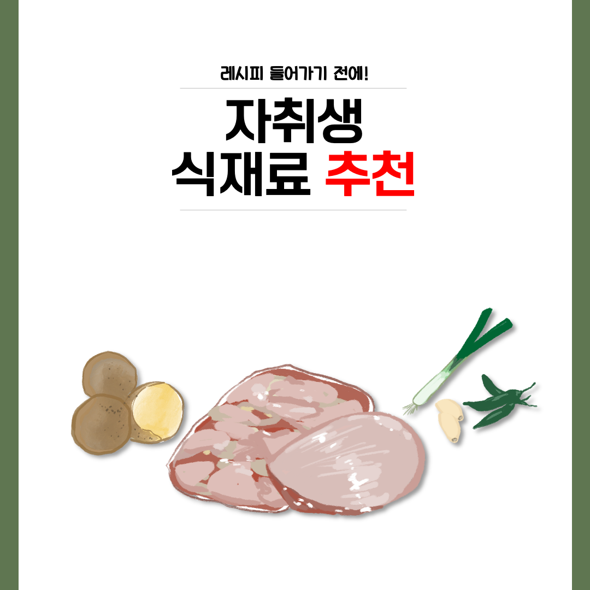
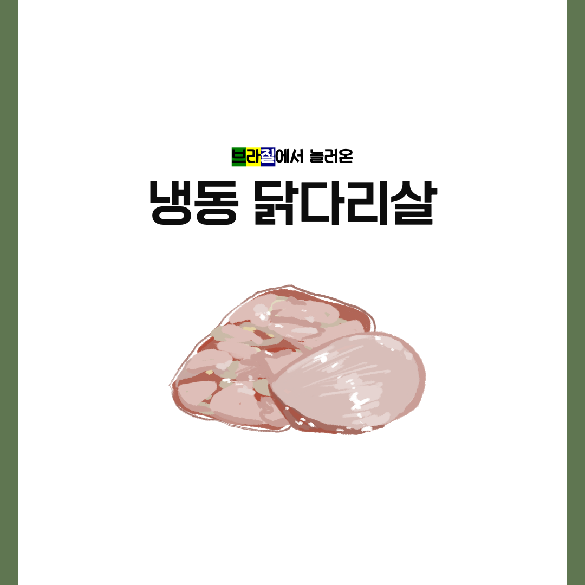
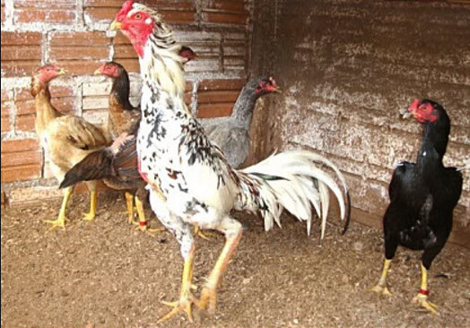
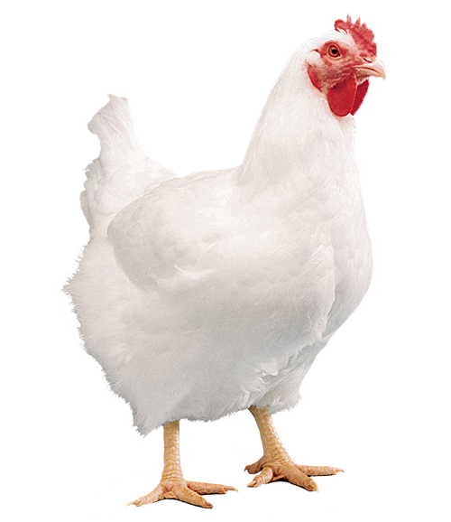
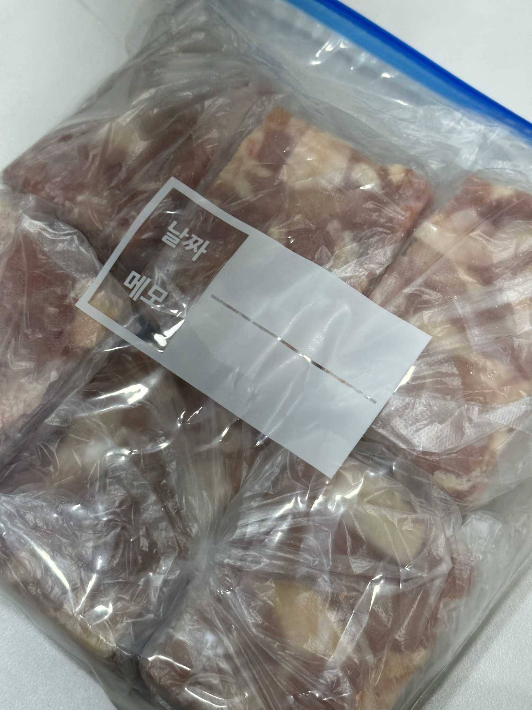
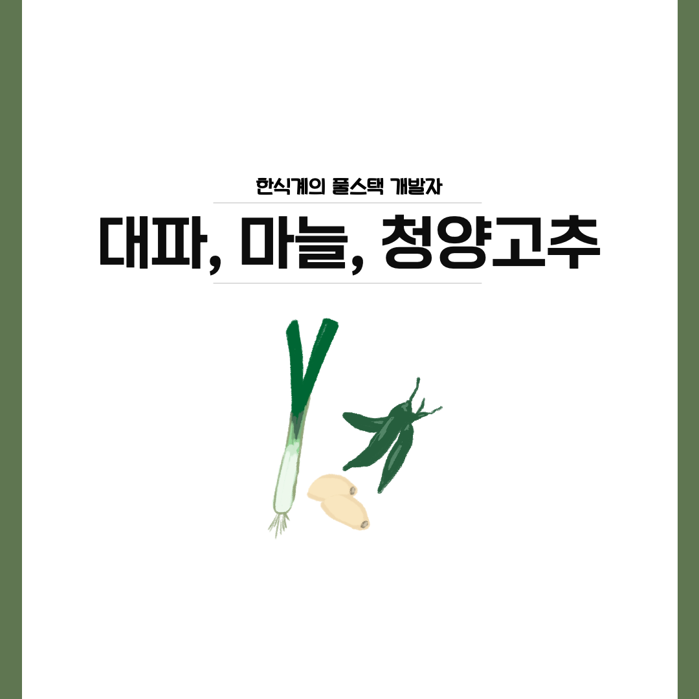
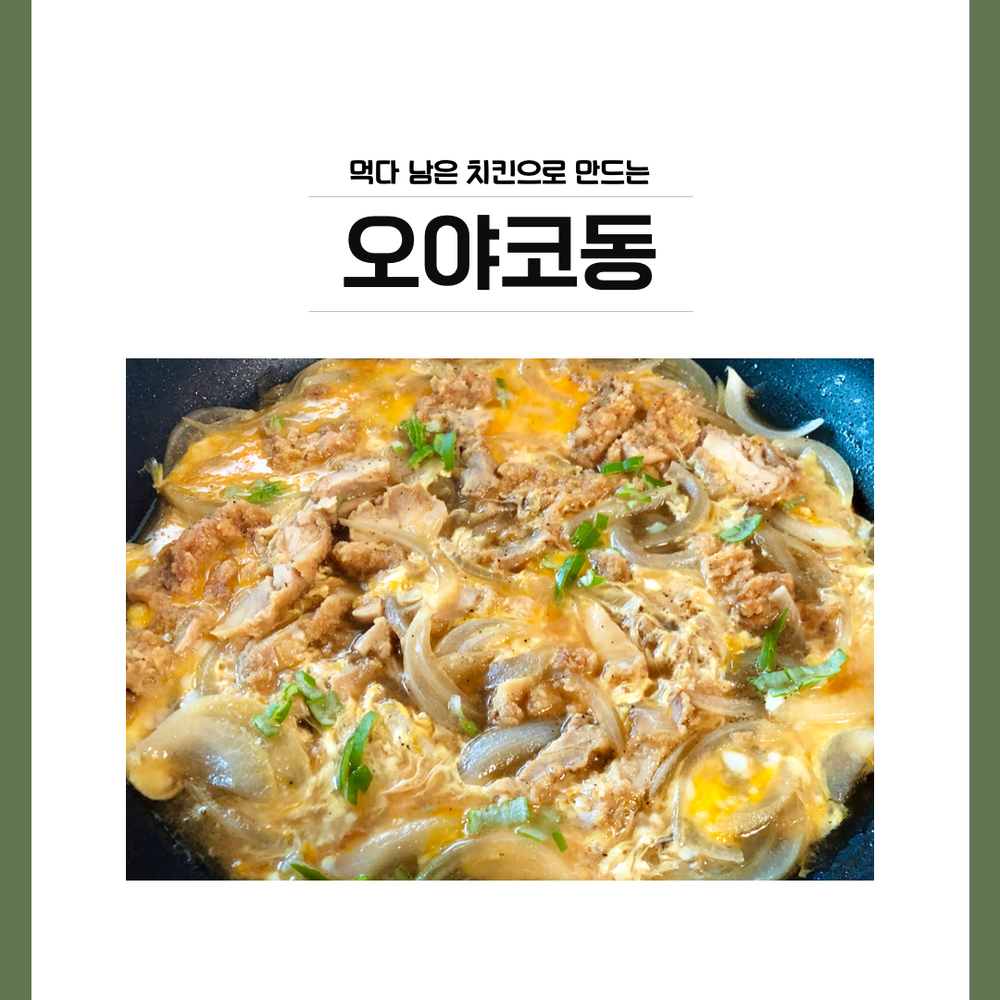
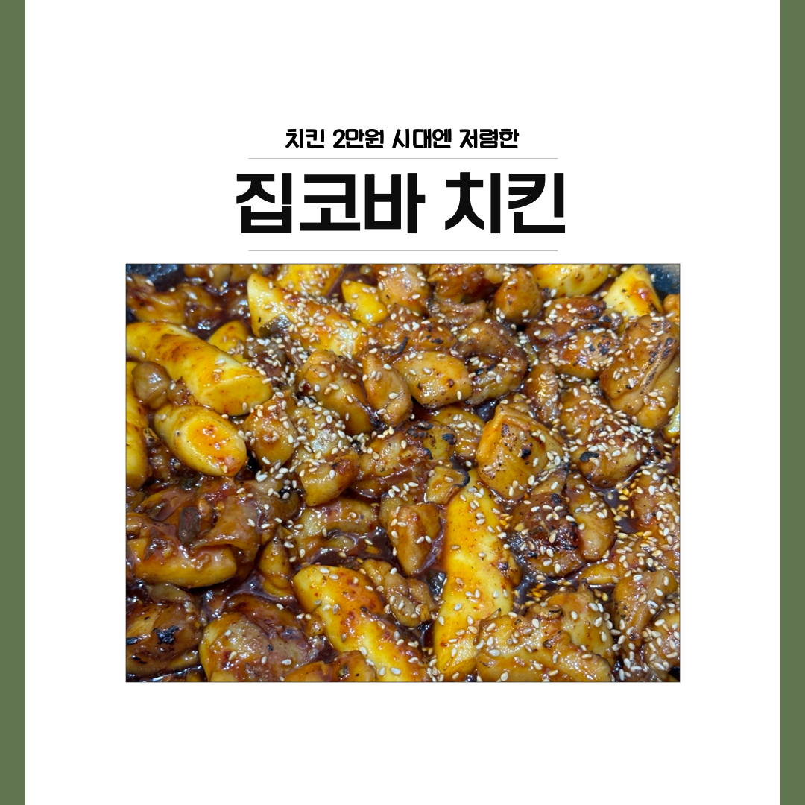
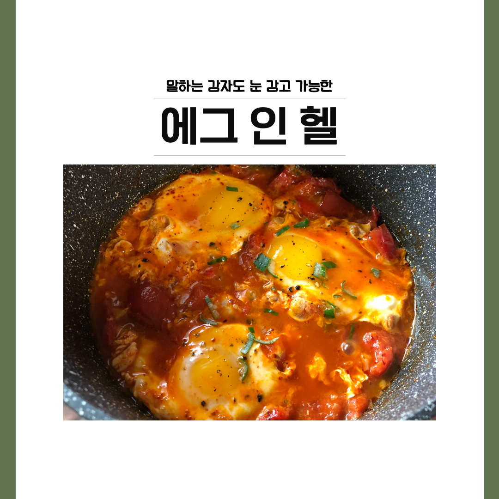
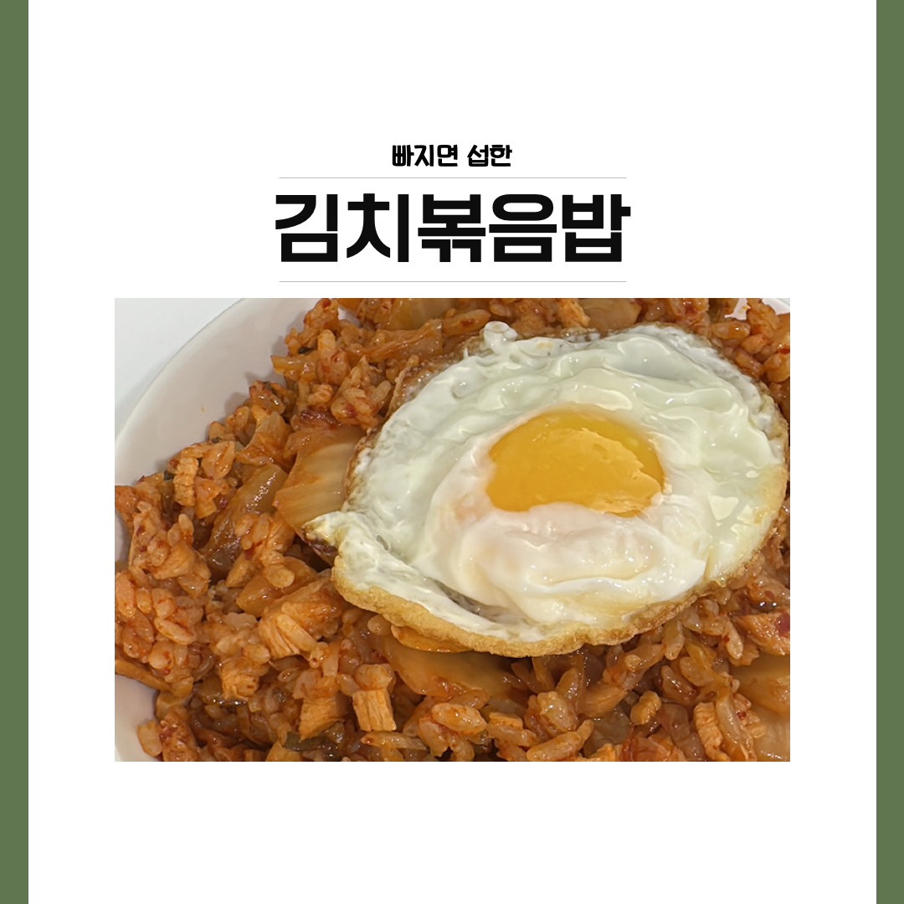

안녕하세요 !! 9기 SSAFYcial 로 인사드리게 된 김지훈입니다.
첫 번째 자율기사인 만큼, 부담 없으면서도 실제로 도움이 되는 주제를 선택하고 싶었는데요! 저는 취사병으로 복무했었고, 현재도 취미로 요리를 이어오고 있는데, 자취생활은 이번이 처음입니다.

본격적인 자취생활 시작 전에는, 마치 에어비엔비 숙소에서 요리를 해 먹듯이 다양한 요리를 할 수 있을 거라 생각하고 기대가 컸었는데요. 하지만 자취를 하면서, 또 싸피 생활을 하면서 요리를  하는 건 어렵다는 걸 깨달았습니다.

그래도 시행착오를 겪으며 가격,시간적인 면에서 바쁜 자취생도 시도해 볼 만한 요리를 몇 가지 발굴했고!
그걸 이번 자율기사에 소개해드려야겠다 생각해서!
자취생을 위한 요리 레시피를 첫 자율기사 주제로 선정했습니다.

바로 보시죠!


---

<br>


<br>

자취생의 요리는 간단해야 하고, 가격이 저렴하고, 보관이 편해야 합니다.
그런 조건을 만족하는 식재료를 먼저 소개하겠습니다. 
<br>
<br>


<br>


**감자**


우리에게 친숙한 감자는 튀겨 먹으면 당연히 맛있겠지만, 삶아 먹어도, 구워 먹어도 맛있는 재료입니다. 특히 칼륨이 많아서 아침에 먹으면 나트륨 배출에 도움이 되는데요, 

흔히 고구마를 아침에 먹는 경우가 많은데 고구마는 타닌과 아교질 성분이 위산 분비를 촉진시킨다고 합니다. 그래서 오히려 아침엔 고구마 보단 감자를 먹는 것이, 탄수화물과 칼륨을 보충할 수 있다는 것입니다.

하지만 어떻게 아침부터 감자를 삶을 수 있을까요..?

입실 시간을 맞추려면 감자는 포기해야 합니다.
그래서 준비한 감자 보관법이 있습니다!

먼저, 새로 구매한 감자를 껍질을 벗겨서 삶습니다.
100% 삶는 것이 아니라, 60% 정도만 삶는 것이 포인트인데요.
다 삶아버리면 삶은 감자를 만들 땐 괜찮지만, 튀기거나 굽는 방식의 요리를 할 땐감자가 다 으스러질 수 있기 때문입니다.

삶아낸 감자는 물기를 제거하고 소분한 후에 냉동 보관용 지퍼백에 넣어서 냉동 보관을 하면오랜 기간 보관도 가능하고, 그때그때 전자레인지에 2분 정도만 데워도 먹을 수 있습니다.

저도 지금 냉장고에 감자가 잔뜩 들어있는데요, 약 1달 전에 보관했는데도 현재까지 아무런 문제가 없습니다.
매일 한 팩씩 꺼내서 데우기만 하면 되니까! 여러분들도 꼭 시도해 보세요!
<br>
<br>



<br>

**냉동 브라질산 닭다리살**

요즘은 조금 친숙해진 재료입니다. 퍽퍽한 닭가슴살과는 다르게 쫄깃하고 기름진 닭다리살은 정말 맛있지만, 비싼 편입니다.

국산 닭다리살은 1kg에 19,000원 정도의 가격대를 형성하고 있는데, 브라질 닭다리는 2kg에 15,000원 정도면 구매할 수 있습니다.

2kg이면 정말 혼자 먹기엔 넘쳐나는 양인데요,
브라질에서 온 닭이라고 꺼려하는 분들도 계실 거라 생각합니다.
<br>
<br>



<br>
<br>


흔히 이런 닭을 브라질 닭이라고 생각하는 사람들도 있는데, 실제로 브라질 닭은
<br>
<br>


<br>

우리가 아는 닭과 똑같이 생겼으니 걱정 마세요 ㅎㅎ
냉동 닭다리살을 구매하셨다면, 감자처럼 소분을 해주셔야 합니다.
2kg를 하루에 다 먹을 수도.. 있겠지만 저는 8 분할을 하는 걸 추천드립니다.


<br>


냉동 상태에서 배송이 오면, 살짝만 해동시켜서 8등분을 해줍니다.그 후에 위생백에 개별 포장한 뒤, 냉동 지퍼백에 밀봉해서 보관하면 장기간 보관이 가능합니다.

이후 요리하기 전날, 위생백 채로 닭고기를 그릇에 옮겨다가 하루 정도 해동을 시켜주면 맛 저하 없이 요리가 가능하다는 거! 꼭 알고 가세요~

그리고 그릇에 옮기지 않으면, 비닐 바깥으로 핏물이 새어 나올 수 있으니 꼭 받칠 그릇을 준비해 주세요!
이런 닭다리살은 닭갈비, 순살 치킨, 닭볶음탕, 찜닭, 닭다리살 볶음밥 등 다양하게 활용이 가능합니다!
<br>
<br>



<br>


**대파, 마늘, 청양고추**

한식의 필수품이죠, 대파와 마늘, 청양고추인데요!
얘네는 한식 요리의 어디든 들어가니 요리에 관심이 있다면 항상 냉장고에 넣어두시기 바랍니다.

이 세 가지 채소는 그때그때 소량으로 구매해서 사먹는 걸 추천드리지만, 바쁜 자취생이 장을 자주 볼 수도 없으니, 냉동 보관법을 알려드리겠습니다.

마늘과 고추는 다져서 아이스 트레이에 넣어서 냉동 보관하면 정말 편합니다.
그때 그때 얼음 한 칸 분량씩만 빼서 쓰면 요리에 부담이 확 줄어들거든요!

대파는 다지면 활용도가 줄어드니, 아이스 트레이 보관 대신,
얇게 썰어서 냉동 보관 용기에 따로 담아서 그때 그때 꺼내 쓰면 됩니다.


네, 이제 식재료 소개는 그만하고!
본격적으로 레시피를 소개하겠습니다. 
<br>

---



**오야코동**

```
재료

먹다 남은 치킨, 달걀, 양파, 
대파, 간장, 물, 설탕 
( ++선택사항 : 치킨스톡, 후추, 쯔유, 미림 )

```

```
계량

달걀 2개, 간장 2큰 술 , 설탕 반 큰술 , 
미림 1큰술, 물 150ml ( 대략적인 비율만 맞춰주시면 됩니다. )

```

<br>

먹다 남은 치킨이 있을 리가 없다는 분들도 계시겠지만 ㅎㅎ
1인 1 닭이 그렇게 쉽지는 않습니다. 그러다 보니 자취를 하면서 치킨을 시키기가 부담되는 경우가 많은데요.

남는 걸 걱정하지 않고, 시킬 수 있는 방법이 있으니 그건 바로 오야코동을 만드는 것입니다!

오야코동은 직역하면 부모 자식 덮밥이라는 좀 잔인하고 슬픈 말인데,
메인 재료로 닭고기와 달걀을 썼기 때문에 부모 자식이라는 것 같네요.
하지만 맛은 정말 좋고, 만들기엔 간단하니 꼭 시도해 보세요!
<br>
<br>

1.  먹다 남은 치킨은 순살이면 잘게 자르고, 뼈닭이면 발라줍니다.

2.  팬에 식용유를 조금 두르고, 달아오르면 손질한 닭을 넣어줍니다.

3.  약불에서 닭을 볶다가 어느 정도 따뜻해졌다 싶으면 양파를 넣어주고 볶습니다.

4.  양파는 꼭 오래 볶을 필요가 없습니다. 취향에 따라 볶아주시면 됩니다.

5.  양파가 볶아지면, 간장과 물, 설탕(미림, 치킨스톡, 쯔유)을 넣어주고 졸입니다. 

6.  물이 끓기 시작하면, 달걀 2개를 풀어다가 넣어줍니다. 위에 대파도 넣어줍니다.

7.  뚜껑을 덮고 30초~ 1분 정도 끓여줍니다.

8.  밥 위에 얹어서 완성합니다.
<br>


**크림치즈 딸기샌드**

```
재료

식빵, 크림치즈, 딸기잼
```

```
계량

먹고 싶은 만큼
```

<br>

바쁜 아침에 먹기에 정말 간편하고 맛있는 요리입니다. 사실 요리라고 하기에도 민망하지만, 크림치즈에 딸기잼을 섞어 먹어본 적이 없으시다면, 이번 기회에 속는 셈 치고 꼭 만들어 보세요!! 


<br>

1. 식빵, 통밀빵, 호밀빵 등 기호에 맞는 식빵을 준비합니다.

2. 크림치즈 역시 좋아하는 브랜드로 준비해서 빵에 발라 줍니다. (개인적으로 마담x익 추천 드립니다.)

3. 딸기잼을 크림치즈 위에 발라줍니다. ( 딸기잼은 복X자리, 데x쉬 가x 추천드립니다.)

4. 완성입니다.


<br>




**집코바 치킨**
```
재료

닭다리살, 떡, 청양고추, 마늘, 간장, 설탕, 미림, 후추, 케찹, 토치 ( ++선택사항 : 치킨스톡, 굴소스, 생강, 볶은참깨 )

```

```
계량 

닭다리살 500g 기준

케찹 : 2큰술

마늘 : 4큰술

물엿 : 4큰술

설탕 : 3큰술

간장 : 4큰술

굴소스 : 1큰술

고춧가루 : 2큰술

미림 : 2큰술

물 : 5큰술

청양고추 : 1~2개

떡 : 8~15개

```


<br>

<br>

오늘 레시피 중엔 제일 번거로운 레시피인데요, 사실 재료 손질을 빼고 나면 금방 만들 수 있는 요리입니다. 다만 토치가 있어야만 불맛을 낼 수 있다는 게 조금 아쉽네요. 하지만 토치가 없어도 맛있는 닭조림은 될 수 있으니까 주저하지 마시고!
한 푼이라도 아껴야 하는 자취생이라면 배달 대신 집에서 x코바를 만들어 보세요!
<br>
<br>

1. 닭다리살은 우유에 재우면 잡내가 사라진다지만, 자취생에게 우유를 그런 식으로 쓰는 건 너무 큰 사치입니다. 그냥 소금과 설탕 2큰술씩 넣은 물에 1시간 정도만 염지 해주세요.


2. 닭이 염지 되는 동안, 양념장 재료들을 한 곳에 넣고 섞어줍니다. 마늘과 청양고추는 다져서 넣어주시면 됩니다.양념장은 미리 숙성해 두면 더 맛있지만, 그런 수고 역시 자취생에겐 사치이므로 즉석에서 만드셔도 괜찮습니다.


3. 염지 된 닭은 한 번 씻고, 물기를 제거한 후에 예열된 팬에다가 구워줍니다. 되도록 껍질이 아래로 가도록 구워주시고, 기름이 너무 많이 나온다 싶으면 키친타월로 제거해 주세요.


3. 닭껍질이 노릇하게 익으면, 만들어 둔 양념장과 떡을 넣고 조려줍니다. 대략 5분 정도 끓이면 먹을 수 있게 되는데, 화력이 다를 테니 살짝 자박하게만 조려주시면 됩니다. 


4. 어느 정도 양념이 졸아들면, 토치를 꺼내서 불맛을 내줍니다. ( 이게 빠지면 x코바 맛이 안 나니 생각한 것보다 더 꼼꼼하게 해 주세요!)

5. 사진과 비슷한 비주얼이 되면 불을 끄고 참깨를 뿌려 마무리합니다.


<br>
<br>



**에그 인 헬**

```
재료 

달걀 N개, 시판 스파게티 소스, 후추, 마늘, 우유 ( 모차렐라 치즈, 파프리카, 베이컨 등 )
```

```
계량 

먹고 싶은 만큼
```


<br>
에그 인 헬의 원래 이름은 샥슈카로, 토마토소스에 야채와 계란 넣어 만든 스튜라는 뜻이라고 합니다.원래 정석대로 요리하려면, 다양한 재료가 필요하겠지만 우리가 누구 ??? 

자취생 입니다.

그냥 마늘에 기름 두르고 볶다가 스파게티 소스 한 통 넣어주고 먹고 싶은 만큼의 달걀만 넣어도 충분히 맛있습니다.
이 기본 틀에다가 먹고 싶은 재료를 추가만 해주시면 됩니다.
냉장고에 처치 곤란한 재료가 있다면, 마늘을 볶을 때 같이 넣고 다 볶아 버리세요.

정말 간단하게 냉장고 청소가 가능한 요리입니다.
<br>
<br>


1. 팬에 기름을 두르고 마늘을 볶아줍니다. (약불)

2. 마늘이 노릇하게 익으면 기호에 따라 추가할 재료 ( ex : 베이컨, 파프리카, 버섯 등 )을 넣고 볶습니다.

3. 재료들이 적당히 볶아지면 스파게티 6큰술 정도와 우유 200Ml 정도를 넣어주고, 조려줍니다.

4. 소스의 농도가 녹진해지면, 달걀과 치즈를 먹고 싶은 만큼 넣은 뒤, 뚜껑을 덮고 윗부분이 하얗게 될 때까지 익혀줍니다.

5. 뚜껑을 열고 달걀이 익었으면 마무리합니다.

6. 식빵이나 바게트에 얹어 먹으면 진짜 맛있습니다.


<br>
<br>



**김치 볶음밥**

```
재료 

김치, 밥, 고기류( 돼지고기, 닭고기, 소고기, 스팸, 참치 등 ), 설탕, 소금, 간장, 후추, 고춧가루 

( ++선택사항 : 대파, 마늘, 굴소스, 물엿 )

```

```

계량 
밥을 제외한 재료들이 햇반 크기가 될 정도

햇반 1개
김치 6큰술
간장 2큰술
설탕 1큰술

```
<br>

분명 4선 요리라고 했지만, 이게 빠지면 아쉬워서 추가로 넣었습니다!

한국인의 소울푸드 김치. 그냥 먹어도 맛있지만 볶아먹으면 더 맛있죠?
그런 의미에서 김치 볶음밥은 간편하면서도 맛있는 친숙한 음식입니다.
그런데 은근히 맛있게 만들기가 힘든데, 대충 해도 맛있게 만들 수 있는 레시피를 공개합니다.


<br>

1.  팬에 기름을 두르고 고기류를 넣고 볶아줍니다.
    <br>
    (고기류 재료에서 나오는 기름을 빼내기 위한 작업입니다.)
    <br>
    (마늘이나 대파가 있으면 고기류 재료를 넣기 전에 볶아서 파 마늘 기름을 내줍니다.)

2. 고기류 재료가 노릇하게 익으면, 김치와 설탕을 넣고 숨이 죽을 때까지 볶습니다.
   
3. 김치가 볶이고 나면 나머지 양념재료를 다 넣고 볶아줍니다.
   
4. 색깔이 진하게 붉어지면, 밥을 넣고 꾹꾹 눌러가며 볶아줍니다.
   
5. 기호에 따라 참기름을 두르고 밥을 누룽지 만들듯 오래 익혀줘도 됩니다.
   
6.  그릇에 옮겨 완성합니다.
<br>

---

네, 지금까지 자취생을 위한 요리 레시피를 알려드렸습니다.

요리는 시도한다는 마음먹는 게 힘들 뿐이지, 막상 만들기 시작하면 정말 쉽게 해낼 수 있습니다.그 사실을 꼭 전해드리고 싶었는데, 잘 전달됐는지 모르겠네요.

여러분, 어려워하지 마시고 오늘 저녁은 직접 만들어보세요! 
그렇다고 라면을 끓이시면 안 됩니다..ㅠㅠ

유튜브에는 친절하고 맛있는 레시피가 더 많으니, 먹고 싶은 음식이 있으면 검색해서라도 꼭 만들어 보세요.
맛있는 하루가 되시길 기원하며 다음엔 기획기사로 돌아오겠습니다.

감사합니다 ^_^
